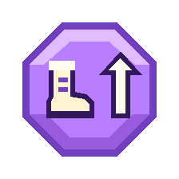

# 2D Space

宇宙を舞台に、重力反転で床と天井を切り替えて進む2Dアクションです。Phase 1の移動、Phase 2の環境ギミック、Phase 3のGrab / Carryを実装しています。

## 必要環境と起動

- Godot 4.7.2 Stable（Standard版）、Git
- Godotに `project.godot` をインポートし、`F5` で実行します。

## 4部屋のチュートリアル

通常起動は `scenes/tutorial.tscn` です。各部屋は1280×720の1画面で、カメラは部屋の中では固定されます。課題をクリアしてプレイヤーの右端が画面右端に届くか、画面左端を越えると隣室へ0.28秒でスライドし、切り替え中だけ操作が止まります。

| 部屋 | 課題と配置 | 新しく使える操作 |
| --- | --- | --- |
| 1：移動・ジャンプ | 平地、64pxと96pxの段差、下に戻れる床を置いた短い穴 | 移動・ジャンプ |
| 2：よじ登り・壁キック | 安全な床のある壁、スタミナを回復できる休憩足場、向かい合う壁 | 壁Grab・壁登り・壁スライド・壁キック |
| 3：ダッシュ | 練習床、360pxの穴、140px高い足場、任意で取れるDash Crystal | 8方向Dash |
| 4：重力切り替え | 安全なUpゲート、天井を歩いて越える障害物、反転中に跳び越す段差、Downゲート、床のゴール | ゲートによる重力反転 |

- 操作説明は、その部屋の課題の近くに表示します。
- 部屋に入ると入口を復帰地点にし、重力Down、速度0、Dash回復、スタミナ最大の状態で始めます。
- 落下またはR / Startで、現在の部屋の入口へ戻ります。その部屋のDash Crystalもすぐに戻ります。
- 左端から前の部屋へ戻れます。習得した壁アクションとDashは、戻ったりやり直したりしても使用可能です。
- 4部屋目で床側の出口に到達すると完了を表示します。その後も戻って練習できます。

部屋の足場・入口・説明文は `scenes/tutorial.tscn` の `Rooms/Room1` ～ `Room4`、切り替えと解禁は `scripts/tutorial.gd` で調整します。風・Spring・運搬などをまとめた既存デモは `scenes/main.tscn` に残しています。GodotでそのSceneを開き、F6で実行できます。

## 操作

| 操作 | キーボード | ゲームパッド |
| --- | --- | --- |
| 移動 | A / D または ← / → | 左スティックまたは十字キー |
| ジャンプ | Space / W | A / × |
| Dash | X + 方向入力 | B / ○ + 左スティック／十字キー |
| Object / 壁を掴む | Shift（長押し） | ZL / ZR（長押し） |
| 壁を昇降 | 掴みながら W / S または ↑ / ↓ | 掴みながら上下入力 |
| やり直し | R | Start |

- **重力ゲート**：赤の↑でGravity Up、シアンの↓でGravity Down。反転中は天井が床です。通常は↑で壁を登り上端へマントル、反転中は↓で登り下端へマントルします。
- **Wall Grab**：床と壁に同時に接していても、Grabキーを長押しすると壁に捕まれます。横入力は不要で、上入力からそのまま登り、低い段差もよじのぼれます。重力反転中は天井への接地から下入力で登ります。壁に捕まっている間のWは登り、接地中のSpace / Aは地上ジャンプを優先します。
- **Wall Stamina**：最大3秒分。接地中は消費せず、床を離れてから重力に逆らって登ると1倍、静止／重力方向へ降りると1/3倍で消費します。0になるとGrab解除。壁へ再接触しても回復せず、現在の床に着地すると全回復します。壁方向への入力による壁スライドは引き続き可能です。
- **8方向Dash**：画面基準の8方向へ一定速度で移動します。無入力なら最後に左右移動した方向（初期は右）。空中では1回まで、着地かDash Crystalで回復します。壁Grabでは回復しません。Dash中も壁に衝突し、重力ゲート通過でDashは止まりません。地上の水平Dashは終了時にも使用可能に戻ります。
- **色／HUD**：Dash使用可能ならBodyは水色、消費済みならオレンジです。HUDは重力、スタミナバー、Dash、Air Jumpを表示します。
- **Superdash相当**：地上で水平Dashし、Dash中または終了後0.12秒以内にジャンプすると、通常ジャンプの高さとDash由来の水平速度を得られます。Dash中のジャンプ入力も短時間バッファされます。
- **Dash Crystal**：緑のひし形に触れるとDashだけが1回へ回復します。Air JumpやWall Stamina、保持中のCreatureのジャンプは回復しません。取得後は消え、2.5秒で再出現します。
- **Jump Crystal**：紫の八角形の中にブーツと上向き矢印を描いたクリスタルです。触れるとAir Jumpを1回得ます。重複取得しても蓄積せず、DashやWall Stamina、保持中のCreatureのジャンプは回復しません。取得後は消え、2.5秒で再出現します。絵の矢印は重力によらず上向きです。
- **Air Jump**：Jump Crystal取得後、地上／コヨーテジャンプと壁ジャンプができない空中でジャンプすると発動。現在の重力に逆らって跳び、水平慣性を保ちます。未使用の権利は着地後も保持します（重力反転中も同様）。使用すると消費し、着地だけでは回復しません。Dashで上へ向かうときは方向入力とXを同時に押すか、Spaceでジャンプ後に方向を指定してください。
- **Respawn**：R / Startまたは画面外落下で、重力Down、Dash使用可能、Air Jumpなし、スタミナ最大へ戻ります。



## 既存のギミックデモ配置（main.tscn）

開始地点から右側の足場と壁で移動・壁Grabを確認できます。Dash Crystalは足場AとBの間の空中 `(700, 330)` と、反転側の `(1540, 240)` にあります。その近くの `(810, 330)` と `(1650, 240)` にJump Crystalを配置しています。緑のひし形でDash、紫の八角形でAir Jumpをそれぞれ取得してください。右へ進むと赤いUpゲート、天井側をさらに進むとシアンのDownゲートがあります。床上の空間では水平Dash→ジャンプを試せます。

F6で実行する `main.tscn` のPhase 2配置：

| ギミック | 位置と試し方 |
| --- | --- |
| 床Spring | `(650, 640)` の黄緑の矢印。落下して触れ、直後に回復したDashを使用 |
| 壁Spring | 右端の壁 `(2320, 340)`。左向きに発射 |
| Moving Gate | `(1230, 470)` ～ `(1530, 470)` を往復する赤いUp。Dashで通過可能 |
| Wind Area | 壁の右側 `(980, 480)`、幅140／高さ320の左風。移動／Dash、左の壁へのGrabと解除を比較 |
| PinballSpring | `(1870, 540)` のピンクの円形バンパー。上・下・左右・斜めから接触し反射方向を比較 |

既存の静止Gate、足場、Dash Crystalの配置はそのままです。

## Phase 2：環境ギミックとInspector

### Moving GravityGate

既存 `gravity_gate.tscn` を拡張しています。`moving_enabled = false` が標準で、既存配置は静止します。有効時は初期位置Aから `A + move_offset` のBへ移動し、両端で待機して往復します。無効化すると移動／待機が一時停止し、再有効化で続きから再開します。

- `move_offset = Vector2(300, 0)`：親座標系の移動先offset。縦・斜めも指定可能。
- `move_speed = 120.0`：移動速度。0では停止。
- `endpoint_wait_time = 0.5`：両端の待機秒数。
- `target_gravity`：Upは赤、Downはシアン。Areaへ再進入するごとに発動。Dash中も重力だけが変わり、Dash方向／速度は維持します。

### Spring

`spring.tscn` はローカル上向きが発射方向です。Sceneのrotationで地面・壁・天井へ配置します。原点が表面、台座はローカル下側です。Playerが表側から接触すると、発射方向と直交する接線速度を保存し、法線成分だけ `spring_speed = 900.0` へ置換します。低速・静止接触でも有効で、裏側や外へ離れる接触は無効です。

1接触につき1回だけ発射し、退出後の再進入で再発動します。Dash／Superdash受付を終了して即発射、その後は通常物理へ戻ります。発射時はDash・Wall Staminaを全回復し、Grab Exhaustedも解除。Air Jumpや保持中のCreatureのジャンプは付与・回復しません。取得済みの未使用Air Jumpは、発射や床との同frame接触、その後の着地でも保持します。Creatureは保持したまま着地したときに回復します。

### PinballSpring

`pinball_spring.tscn` は半径32の円形バンパーです。見た目と当たり判定が円形で、全周から接触できます。円の中心から接触時のPlayer中心へ向かう方向を表面法線とし、接触直前の速度を反射します。同じ進行方向でも、円のどこに当たるかによって跳ねる方向が変わります。Sceneのrotationは反射方向に影響しません。Dash突入時もDash速度で反射してからDashを終了し、Springと同じDash・Wall Stamina回復を行います。Air Jumpや保持中のCreatureのジャンプは付与・回復しません。

- `minimum_bounce_speed = 800.0`／`maximum_bounce_speed = 1200.0`：反発速度の下限／上限。範囲内の入射速度は保存（下限が上限より大きい場合は下限を優先）。
- `min_impact_normal_speed = 50.0`：表面へ向かう法線速度の最低値。浅い擦れは発動せず、反射は必ず外向き。1接触につき1回です。

### Wind Area

`wind_area.tscn` は半透明の領域と方向矢印です。地上・空中・Wall Slide中に加速度として作用し、追い風では押され、向かい風にも入力で逆らえます。Dash中・Wall Grab中は無効で、解除後に再適用します。

- `wind_direction = Vector2.RIGHT`：world基準の任意方向。正規化して使用し、ゼロなら無風。GravityやScene rotationでは反転しません。
- `wind_acceleration = 900.0`：加速度。
- `max_wind_speed = 500.0`：風方向への速度成分の上限。直交成分や既に上限を超えるJump／Spring速度を切り詰めず、Windによる加速分だけを制限します。
- `area_size = Vector2(260, 240)`：領域サイズ。Inspectorで変更すると当たり判定と表示が追従します。

複数Areaでは加速度をベクトル合成します（右900＋上900なら `(900, -900)`、反対方向なら相殺）。合成方向に対して有効Areaの最大 `max_wind_speed` を使います。登録はArea単位で、退出・削除時にその寄与だけを解除します。通常の重力方向の落下上限／Wall Slide上限とCollisionは引き続き適用します。

## Sceneの担当分け

- `scenes/player.tscn` / `scripts/player.gd`：移動、壁アクション、スタミナ、Dash、Air Jump
- `scenes/stage.tscn`：足場と当たり判定
- `scenes/gravity_gate.tscn` / `scripts/gravity_gate.gd`：重力変更、方向別の自動配色
- `scenes/refill_crystal.tscn` / `scripts/refill_crystal.gd`：Dash回復と再出現
- `scenes/jump_crystal.tscn` / `scripts/refill_crystal.gd`：Air Jump付与と再出現（`refill_kind = AIR_JUMP`）。再出現処理はDash Crystalと共通
- `scenes/spring.tscn` / `scripts/spring.gd`：固定方向の発射とDash・Wall Stamina回復
- `scenes/pinball_spring.tscn` / `scripts/pinball_spring.gd`：入射角に応じた反射とDash・Wall Stamina回復
- `scenes/wind_area.tscn` / `scripts/wind_area.gd`：風の登録・解除と表示
- `scenes/hud.tscn` / `scripts/hud.gd`：操作説明と状態表示（Playerのsignal/getterを使用）
- `scenes/main.tscn`：各Sceneのデモ配置
- `scenes/tutorial.tscn` / `scripts/tutorial.gd`：4部屋のチュートリアル、部屋切り替え、操作の解禁、復帰地点

調整値はPlayer／CrystalのInspectorから変更できます。同じSceneを複数人で同時編集せず、担当ごとにブランチを分けます。

## 自動テスト

```powershell
Godot_v4.7.2-stable_win64_console.exe --headless --path . --script res://tests/base_system_test.gd
Godot_v4.7.2-stable_win64_console.exe --headless --path . --script res://tests/phase1_movement_test.gd
Godot_v4.7.2-stable_win64_console.exe --headless --path . --script res://tests/phase2_environment_test.gd
Godot_v4.7.2-stable_win64_console.exe --headless --path . --script res://tests/phase3_grab_test.gd
Godot_v4.7.2-stable_win64_console.exe --headless --fixed-fps 60 --path . --script res://tests/tutorial_rooms_test.gd
```

それぞれ `BASE_SYSTEM_TEST_OK` / `PHASE1_MOVEMENT_TEST_OK` / `PHASE2_ENVIRONMENT_TEST_OK` と終了コード0で成功です。baseは入力・移動・壁・重力とデモ配置、Phase 1は両重力・左右両側の接地からのGrab／低い段差のマントル／ジャンプ優先と接地中のスタミナ、空中のマントル／スタミナ・Dash・色・ジャンプ連携・2種類のクリスタルの効果分離／再出現・Respawnを検証します。Phase 2はGate往復・実接触、4方向Spring、反射と速度範囲、追加ジャンプを付与しないことと未使用の権利の保持、同frame着地回復、Wind合成・能力相互作用・削除を検証します。

`TUTORIAL_ROOMS_TEST_OK` は、操作の制限と解禁、部屋内の固定カメラ、画面端での切り替え、段差と穴のジャンプ、壁登りと壁キック、水平・斜めDashでの攻略、重力ゲートとゴール、各部屋への復帰、戻った後の操作維持、Crystalの復帰を確認します。


## Phase 3：Grab / Carry

Shift / ZL / ZRを長押しすると、半径 `grab_range = 60` 内で壁に遮られていない最寄りObjectを優先して掴みます。対象がない場合は従来のWall Grabです。低い天井の下でも取得できます。Object保持中はWall Grab／壁登りを使いませんが、壁キックと壁スライドは使用できます。Dash中の新規Grabは禁止ですが、Dash終了後も押していればGrabできます。保持済みならDash、Spring、円形Pinball、静止／移動GravityGate、Windでも保持を続けます。

Wall Grab中は、登り・静止・降りのいずれでも近くのObjectを自動で掴みません。Grabキーを一度離して押し直した場合は、範囲内のObjectを優先して掴みます。登り切り・壁からの離脱・スタミナ切れ・壁ジャンプでWall Grabが終わったときは、Grabキーを押したままならその時点の範囲内のObjectを自動で掴みます。Dash中は引き続き新規Grabしません。

ボタンを離した瞬間の**実velocity**の長さが `throw_move_threshold = 80` 未満ならDrop、80以上ならThrowです。Input方向やGravityではなく、実velocity方向へ `player_velocity + direction * throw_speed` を与えます。Dropは慣性だけを引き継ぎ、追加投擲速度を与えません。通常の `throw_speed = 450`、Heavyは300です。停止からDashと同frameに離した場合も、Dash速度を設定してからThrowします。Spring／Pinballの発射後も同じ操作です。

### Jump Creature

緑のCreatureを保持中だけ独立した追加空中Jumpを1回使えます。優先順はGround／Coyote → Wall → Jump CrystalのAir Jump → Creatureです。残数はCreature自身が保持し、Drop→再Grabでは回復しません。

プレイヤーの胴体内に、Air Jumpと保持中のCreatureを合わせた**追加ジャンプ残数**を白い山形＋暗い縁取りで表示します。1回なら1個、2回なら縦に2個、0回なら非表示です。地上・Dash中も表示し、重力反転に合わせて向きが変わります。残数が増えた瞬間だけ軽く拡大して戻り、消費やCreatureのReleaseはすぐ表示に反映されます。由来による区別はせず、体色は従来どおりDashの使用可否を示します。

保持したまま現在の床へ着地するとCreatureが回復し、未使用のAir Jumpは保持します。Air Jumpが残っていれば表示2、消費済みなら表示1になります。Spring／Pinballと、どちらのCrystalでもCreatureのジャンプは回復しません。

### Heavy Object

銅色の分銅型の箱は `weight = 2.0`。太い輪の取っ手と幅広の底で重さを表現し、取っ手を含めた見た目を既存の32×32の当たり判定内に収めています。保持中だけ移動速度・地上加速・空中加速が0.75倍、通常Jump速度が0.85倍になります。PlayerのInspector値を変更せず実効値で計算し、Releaseで即解除します。Dash速度／時間／回数、Wall Stamina、Wall Climb／Jump、Superdash、Gravityは変わりません。

軽い箱は24×24の段ボールです。上面の継ぎ目、中央の梱包テープ、角の折れと配送マークを描いています。重量は0.5で、持っても移動やジャンプの能力は変わりません。両方とも当たり判定は四角のままです。

### Parachute Creature

黄色の傘を保持中だけ、現在の重力方向への落下成分を `parachute_fall_speed = 180` に制限します。横速度と上昇速度を維持し、Gravity Upにも対応します。Wind適用後に制限するため、横風では流され、強い上風では上昇でき、下風でも上限を超えません。Dash中は無効、Spring／Pinball発射後は `parachute_launch_grace = 0.15` 秒の猶予があります。Releaseで即解除します。

### Pressure Button

赤茶色のPlateはArea内の、手放されているGrabbable重量を合算し、`required_weight = 2.0` 以上で緑へ変わって沈みます。Heavy 1個または軽量0.5を4個でON、離れて不足するとOFFです。Bodyは重複加算しません。`include_player = false` が標準で、trueの場合のみPlayerの `weight = 1.0` も加算します。

`pressed_changed(is_pressed: bool)` と `is_pressed()` を公開しています。Door等への接続はありません。Heavyを動きながら離して投げ、Plateへ着地させることでも操作できます。

### Carryの衝突と公開API

- `grabbable.tscn` / `grabbable.gd` は1つの `CollisionShape2D` を持つRigidBody2Dの共通基盤です。派生Scene／Scriptが重量、投擲速度、Modifier、追加Jump、落下上限を提供します。
- Playerは `try_begin_grab()` / `release_grab()` / `get_held_object()` / `get_available_extra_jump_count()` と実効移動値のgetter、`carry_changed` signalを公開します。外部ObjectはPlayerのprivate stateを変更しません。
- Carryは頭側の `carry_offset = Vector2(0, -48)`。重力Upでは画面下へ反転し、左右のFacingには影響されません。保持中はRigidBodyをfreezeし、回転・速度を停止します。
- 保持中だけcollision layer／maskを0にして、壁・床・天井・Player・他Bodyとの物理衝突を無効化します。Shape自体は残してRelease位置の検査に使用します。保持アイテムが地形に重なってもPlayerの移動・方向転換を制限しません。重量スイッチには加算しません。
- Grab時はPlayerと対象の中心を結ぶRayで遮蔽物を確認します。薄い壁越しの取得は禁止し、取得後の頭上配置経路と天井への重なりは許容します。非Solid Areaは取得を妨げません。
- Release時に地形や他Bodyへ重なっていれば、保持位置からPlayer中心へ約1px刻みで安全位置を探します。Playerとの一時的な重なりは許容します。安全位置がなければ保持を継続し、ボタンを離している間は毎frame再試行します。待機中も移動できます。
- Releaseで元のcollision layer／maskとRigidBodyの物理を復帰します。Playerは通常移動でアイテムを穏やかに押せます（押す方向の目標速度は最大120px/s）。重なったペアは一時的に相互衝突だけを外し、Playerを地形に衝突する移動で毎秒60pxずつ離し、アイテムにも逆方向の押し返しを与えます。床・天井に挟まれている場合は横方向へ解消し、分離後に相互衝突を戻します。強制ノックバックは与えません。
- R / Start／画面外Respawnで全Grabbableの初期位置・回転・速度・Collision・Jump残数を戻します。Buttonは物理同期後、戻ったBodyの位置に応じて再集計します。

保持位置はPlayerの `carry_offset`、押す速さは `object_push_speed = 120`、重なりを解消する速さは `overlap_separation_speed = 60` で調整できます。

### Phase 3デモ手順

既存デモの `main.tscn` に次を追加しています。Phase 1・2の配置は維持しています。

| Object | 初期位置 | 確認方法 |
| --- | --- | --- |
| Jump Creature | `(250, 610)` | 近づきShiftを保持。床Spring `(650, 640)` で表示2にし、空中Jumpを2回使って2→1→0。離して再Grabしても回復しないことを確認 |
| Light Box | `(320, 610)` | 段ボールの軽い箱。Heavyとの見た目と持ち運びの違いを比較 |
| Heavy Object | `(400, 610)` | 足場Aの下でGrabし移動差を比較。右へ移動して離す／Dashと同時に離すと投擲 |
| Pressure Button | `(530, 640)` | HeavyをPlateへ投げるか上でDropし、緑のONを確認。外へ運ぶとOFF |
| Parachute Creature | `(1000, 610)` | 左風内でGrabしてJump→ゆっくり落下。Upゲートで反転し天井へゆっくり落下。保持したままSpring／PinballやDashも比較 |

狭い足場下で取得・方向転換し、壁際で保持したまま壁キックできることを確認できます。低い天井にアイテムが重なった状態で離すと、Player側へ補正してから物理を復帰します。HUDは既存のGravity／Stamina／Dash／Air Jumpに **CARRY: NONE / JUMP / HEAVY / PARACHUTE** を追加しています。

### Phase 3テスト

上記4本をGodot 4.7.2 headlessで実行します。新しい `tests/phase3_grab_test.gd` は `PHASE3_GRAB_TEST_OK` と終了コード0で成功です。保持中の衝突無効化と頭上追従を各テストframeで確認し、両重力の壁キック／壁スライド、低い天井での取得と方向転換、薄い壁越しGrab拒否、Release位置補正・待機・自動再試行、狭い通路での重なり解消、通常移動での押し合いを検証します。入力の共有・優先順位、Drop／全方向Throw／同frame Dash Throw、独立Jump残数と表示、Heavyの例外、ParachuteとWind／Launch猶予、実RigidBodyの投擲からButton ON、Respawnも対象です。

Wall GrabとObject Grabの切り替えは両重力で検証します。壁を掴んだままの登り・静止・降りでは取得せず、キーの押し直しと、登り切り・降り切り・スタミナ切れ・壁ジャンプでの解除時には取得すること、Dashによる解除では取得しないことを確認します。
