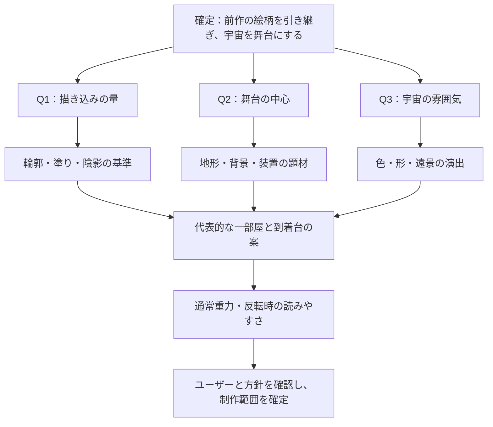

# 忍者ぶっとびくん Galaxy：ステージとオブジェクトの絵柄

検討中の方針案。第一ラウンドの回答を待っており、以下の推奨案はまだ採用決定ではない。

## 今回の前提と検討範囲

- 前作『忍者ぶっとびくん』の絵柄を引き継ぐ。
- 今作の舞台は宇宙。背景・地形・到着台などを宇宙の題材で揃える。
- 緑色の生物と傘は現在のままでよい。
- 今回はデザイン方針の検討。ゲーム素材の変更はまだ行わない。

## 素材を見て分かったこと

添付ZIP `ef57a30c2f8ce30c.zip` 内のタイトルには「忍者ぶっとびくん」の表記があり、現作へ引き継いだ忍者と同じ姿の素材がある。前作の参照として、主人公・城・木の壁・足場・星・雲を確認した。

前作の特徴は、少し揺れた黒い輪郭、大きく単純な形、少ない色と細部、控えめな陰影。木の壁には数本の大きな木目、城には不揃いな窓や石垣の線がある。横長の木の足場には薄いグラデーションがあるので、「陰影を一切使わない」とは定義しない。

抽出したテクスチャの周囲にある圧縮ノイズや余分な画素は、絵柄の特徴として再現しない。前作の完成したプレイ画面での背景色・重ね方は未確認。

現作の保存済み画面では、忍者は手描きの絵、地形は無地の青い長方形、到着台は強い光沢と整った立体表現になっている。題材に加えて、輪郭・陰影・描き込みの量が違う。星空には宇宙の記号があるが、地形や装置と合わせた世界の特徴はまだ少ない。

## 推奨する趣旨

「忍者が迷い込んだ、手描きのへんてこ宇宙」。宇宙基地や惑星を、前作の城や木の足場を描いた人が続けて描いたように見せる。

宇宙らしさは惑星・クレーター・宇宙基地・アンテナなどの形で伝える。輪郭、塗り、細部の量は前作に合わせる。忍者の藍色や手足の灰色に、くすんだ紫・生成り・淡い黄土色などを合わせる。操作に関わる部分は背景よりはっきりさせる。

| 対象 | 具体案 | 前作とのつながり・遊びの読みやすさ |
| --- | --- | --- |
| 背景 | 落ち着いた紺〜紫の空に、手描きの惑星、少数の星、遠い宇宙基地 | 大きな単純な形と少ない細部で描く。遠景の輪郭と明暗は弱め、足場と混同させない |
| 地形 | 月岩と、継ぎ目や大きなボルトが少しある宇宙基地の板・壁 | 木目をクレーターや継ぎ目に置き換え、同じ手描きの輪郭と控えめな陰影で描く |
| 到着台 | 星印のある赤い押し板と、灰色または生成りの簡素な台座 | 白い光沢や金属の反射を減らす。踏む面、押し込まれる厚み、沈んだ状態を形で示す |
| ロックケース・鍵 | 輪郭と少数の反射線で描く透明ケース、単純な黄色い南京錠 | 中の到着台が見える透明度を保つ。閉じた鍵と開いた鍵の形を区別する |
| 重力ゲート | 薄い通過領域に、手描きの枠や短い支柱、上・下の矢印 | 通れる場所だと分かる隙間を残す。既存の上向き赤・下向きシアンを矢印と併用する |
| Spring・反発板 | 簡素なばね付き発射板、丸いクッション状の反発板 | 固定方向へ飛ばすものと、接触方向で跳ね返すものの形を分ける |
| 風ゾーン | 少数の流線や粒、宇宙基地側の送風口 | 流れる方向を読めるようにし、傘を持った忍者を隠さない |
| 箱・クリスタルなど | 既存の形や機能を保ち、手描きの輪郭と少ない陰影で整える | 軽い箱と重い箱、Dash CrystalとJump Crystalを見分けられるようにする |

到着台は出口を開くスイッチであり、Springのような発射装置ではない。星や宇宙の模様を付けても、上に乗って押す仕掛けとして描く。運搬物で操作する重量スイッチとも区別する。

地形の飾りは側面へ置き、歩く面や壁キックする面は読みやすく保つ。天井も足場になるため、上面だけに足場の縁を描く方法では足りない。上下・左右の接触面を確認し、クレーターや欠けの絵が実際の穴に見えないようにする。

ステージの違いは、基地・月岩・遠景の惑星の組み合わせや色で出す。同じゲーム内で、ステージごとに線の描き方や光沢の強さを変えない。

## 設計の分岐と第一ラウンド

1. **描き込みの量**：前作と同程度の素朴な線と塗りを残すか、手描きの線を残しつつ陰影や細部を少し増やすか。推奨は前者。現作の忍者を基準にして、装置だけ描き込みが増える状態を避ける。
2. **舞台の中心**：小惑星と宇宙基地が混在する世界、宇宙船・基地の内部、惑星の自然地形のうち、どれを中心にするか。推奨は小惑星と宇宙基地の混在。自然の岩と重力を扱う装置を同じ舞台に置きやすい。
3. **宇宙の雰囲気**：親しみやすく少しへんてこな宇宙か、広大さや神秘を感じる宇宙か。推奨は前者。後者を選ぶ場合も線と塗りの基準は前作に合わせる。

Q1〜Q3は回答待ち。それぞれの回答を受けて、代表的な一部屋、到着台の姿、操作に関わる表示の扱いを次のラウンドで詰める。背景や装置の案をすべて確定した扱いにはしない。

## 参照した素材

- 添付ZIP `ButtobiKun_Data/sharedassets0.assets`：`TitleImage (1)`。
- 同 `sharedassets1.assets`：`tachi`、`ashiba_n`、`wood`。
- 同 `sharedassets2.assets`：`shiro`。
- 同 `sharedassets3.assets`：`雲`。
- 同 `sharedassets4.assets`：`星`。
- 現作：`docs/sprites/legacy-character-poses.png`、`docs/screenshots/stage-2/room_1.png`、`docs/screenshots/characters/main.png`、`docs/screenshots/arrival/overview.png`。
- 用語と仕掛けの意味：`CONTEXT.md`。重力反転時の接地、到着台、重量スイッチは既存の定義に従う。

今回は素材生成・ゲームへの組み込み・実プレイでの視認性確認は行っていない。方針が固まったら、代表的な一部屋で通常重力と反転時の両方を確認する。
