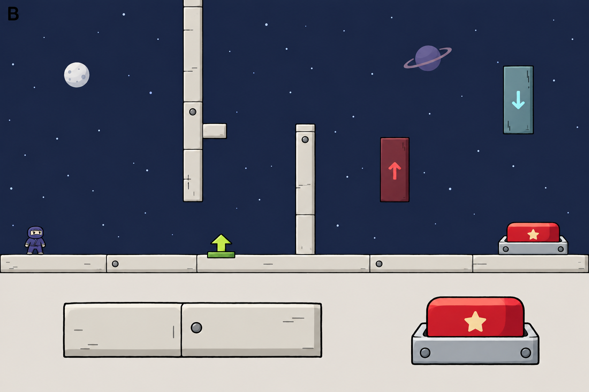
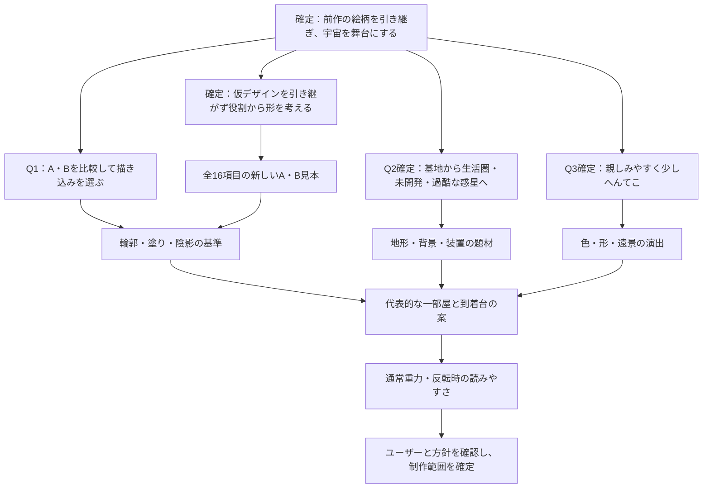

# 忍者ぶっとびくん Galaxy：ステージとオブジェクトの絵柄

舞台は宇宙基地から生活圏のある惑星、未開発の惑星、人が住みづらい惑星へ進む。雰囲気は親しみやすく、少しへんてこにする。描き込みの量はA・Bの比較サンプルを見て決める。

## 今回の前提と検討範囲

- 前作『忍者ぶっとびくん』の絵柄を引き継ぐ。
- 今作の舞台は宇宙。背景・地形・到着台などを宇宙の題材で揃える。
- 緑色の生物と傘は現在のままでよい。
- 各オブジェクトの形は仮デザインを引き継ぐ前提にせず、ユーザーが役割を一目で理解できる形から考え直す。
- 描き込みは前作と同程度を基本とし、平坦でつまらない場合は、元の絵柄と違和感のない範囲で陰影・細部を増やす。
- ステージが進むにつれて環境を険しくし、ひとつのステージの中では環境テーマを統一する。
- 今回はデザイン方針の検討と比較サンプルの生成。ゲームへの組み込みはまだ行わない。

## 素材を見て分かったこと

添付ZIP `ef57a30c2f8ce30c.zip` 内のタイトルには「忍者ぶっとびくん」の表記があり、現作へ引き継いだ忍者と同じ姿の素材がある。前作の参照として、主人公・城・木の壁・足場・星・雲を確認した。

前作の特徴は、少し揺れた黒い輪郭、大きく単純な形、少ない色と細部、控えめな陰影。木の壁には数本の大きな木目、城には不揃いな窓や石垣の線がある。横長の木の足場には薄いグラデーションがあるので、「陰影を一切使わない」とは定義しない。

抽出したテクスチャの周囲にある圧縮ノイズや余分な画素は、絵柄の特徴として再現しない。前作の完成したプレイ画面での背景色・重ね方は未確認。

現作の保存済み画面では、忍者は手描きの絵、地形は無地の青い長方形、到着台は強い光沢と整った立体表現になっている。題材に加えて、輪郭・陰影・描き込みの量が違う。星空には宇宙の記号があるが、地形や装置と合わせた世界の特徴はまだ少ない。

## 推奨する趣旨

「忍者が迷い込んだ、手描きのへんてこ宇宙」。宇宙基地や惑星を、前作の城や木の足場を描いた人が続けて描いたように見せる。

宇宙らしさは惑星・クレーター・宇宙基地・アンテナなどの形で伝える。輪郭、塗り、細部の量は前作に合わせる。忍者の藍色や手足の灰色に、くすんだ紫・生成り・淡い黄土色などを合わせる。操作に関わる部分は背景よりはっきりさせる。

| 対象 | 具体案 | 前作とのつながり・遊びの読みやすさ |
| --- | --- | --- |
| 背景 | 落ち着いた紺〜紫の空に、手描きの惑星、少数の星、遠い宇宙基地 | 大きな単純な形と少ない細部で描く。遠景の輪郭と明暗は弱め、足場と混同させない |
| 地形 | 月岩と、継ぎ目や大きなボルトが少しある宇宙基地の板・壁 | 木目をクレーターや継ぎ目に置き換え、同じ手描きの輪郭と控えめな陰影で描く |
| 到着台 | 足跡のある丸いゴール台と小さなチェッカー旗 | 忍者が乗る面と、沈んで完了する状態を示す。箱を置く重量スイッチとは形を変える |
| ロックケース・鍵 | 透明の保護フードとロック・課題進捗の記号 | 中の到着台を見せ、課題達成で覆いが消えることを伝える |
| 重力ゲート | 中央を空けた対の発生器と上下の矢印 | 通過できる領域を示す。重力方向とゲート自身の移動方向を別の記号で示す |
| Spring・反発板 | 接触板とばね、丸い弾性体 | 一方向へ発射する面と、全方向へ反発する面を形から区別する |
| 風ゾーン | 送風口と流れる線、控えめな作用範囲の目印 | 風の方向を読み取りやすくし、通れない壁や危険な光線に見せない |
| 箱・回復アイテムなど | 手掛かりのある運搬物、速度と跳躍を示す回復アイテム | 持つ・拾うという違いと、重さ・能力の種類を輪郭や記号から伝える |

到着台は出口を開くスイッチであり、Springのような発射装置ではない。星や宇宙の模様を付けても、上に乗って押す仕掛けとして描く。運搬物で操作する重量スイッチとも区別する。

地形の飾りは側面へ置き、歩く面や壁キックする面は読みやすく保つ。天井も足場になるため、上面だけに足場の縁を描く方法では足りない。上下・左右の接触面を確認し、クレーターや欠けの絵が実際の穴に見えないようにする。

ステージの違いは、基地・月岩・遠景の惑星の組み合わせや色で出す。同じゲーム内で、ステージごとに線の描き方や光沢の強さを変えない。

## ステージが進むにつれて環境を険しくする

環境の段階分けはユーザーの回答で確定。以下の個々の題材は、その段階分けを同じ絵柄で表現するための案であり、具体的なステージ数や既存ステージへの割り当ては未確定。

| 環境の段階 | 地形・背景の題材案 | 険しさの表現 |
| --- | --- | --- |
| 人工感のある宇宙基地 | 生成りや灰色の整備された板、柱、アンテナ、整った継ぎ目 | 規則的な形と安定した足場で、管理された場所に見せる |
| 人っ気のある惑星 | 土と岩に、家、橋、畑、生活に使う設備が混ざる | 自然の地形が増えても、整備された道や建物で生活圏を伝える |
| 未開発の惑星 | 岩棚、崖、不思議な植物、自然にできた地形 | 建物と整備された道を減らし、地形の不規則さを増やす |
| 人が住みづらい環境の惑星 | 荒野、大きな裂け目、火山や氷、強い風など | 支配的な環境をステージごとにひとつ選び、形・配色・風景で過酷さを伝える |

輪郭の太さ、色数の目安、陰影の描き方、仕掛けの見分け方は全段階で揃える。岩を険しく描く場合も、実際に歩ける・掴める面と、側面の飾りを区別する。過酷さを示すために全体を暗くしたり描き込みを増やしたりすると、忍者と仕掛けが読みにくくなるため、地形の形や生活圏の有無で差を出す。

到着台や重力ゲートの具体的な外見と、自然中心の惑星で人工装置をどう馴染ませるかは、絵柄の選択後に詰める。段階が進むことによる攻略難度や新しいギミックの追加は、この絵柄の検討では決めない。

## A・Bの比較サンプル

初回は同じ宇宙基地の部屋を使い、下段に足場と到着台の拡大図を置いた。AをもとにBを編集し、構図・色・物の形を揃えて描き込みを比較した。その後、ユーザーの指示により、仮デザインを引き継がず役割から形を考え直す方針にした。以下の初回サンプルは描き込みの比較資料として残し、オブジェクトの形の採用案とはしない。

- **A：前作と同程度を目指した描き込み**。少し揺れた黒い輪郭、大きな単色の面、少ない継ぎ目やボルトで宇宙基地を描く。
- **B：控えめに陰影・細部を加えた描き込み**。Aの形と線を残し、足場の縁、到着台の赤い板と台座、惑星に小さな陰影を加える。白い強い光沢や写実的な材質には寄せない。

比較するときは、まず上段の通常表示で忍者と周囲の絵が馴染むか、足場や仕掛けを読めるかを見る。その後、下段の拡大図で陰影と細部の量を比べる。拡大図の見栄えだけでは選ばない。

生成手段と使用したプロンプトは [生成プロンプト](art-direction/PROMPTS.md) に記録した。

## ギミック全項目の新しいデザイン見本

独立ギミック12種類と関連する仕組み4項目を、役割から考え直したA・Bの見本にした。到着台は足跡付きの丸いゴール台、重量スイッチは運搬物の記号付き計量トレーとし、操作する対象を見分ける。既存の役割・方向・状態と全16項目の見本は [ギミックの一覧とデザイン](gimmick-design.md) に記録した。

現時点では、これらの新しい見本を基準に描き込みと個々の形を検討する。ゲームへの組み込みはまだ行っていない。

## 設計の分岐と回答状況

1. **Q1：描き込みの量**。前作と同程度を基本とし、必要な場合は違和感のない範囲で陰影・細部を増やしたい、という条件は確定。ユーザーの依頼によりAとBを生成した。両案を見ての選択は回答待ち。現時点の推奨は、前作の線を保ちつつ足場や装置の厚みを読みやすくできるB程度。
2. **Q2：舞台の中心**。小惑星と宇宙基地の混在を採用。基地、生活圏のある惑星、未開発の惑星、人が住みづらい惑星へ、ステージごとに環境を険しくする。同じステージ内では環境テーマを統一する。
3. **Q3：宇宙の雰囲気**。「親しみやすく、少しへんてこ」を採用。

次の判断点は、新しいギミック見本のA・Bのどちらが忍者と馴染むか、各項目の形から役割を読めるか。絵柄と各項目の姿を選んだ後に、各環境テーマへの馴染ませ方と、通常重力・反転時の読みやすさを詰める。

## 参照した素材

- 添付ZIP `ButtobiKun_Data/sharedassets0.assets`：`TitleImage (1)`。
- 同 `sharedassets1.assets`：`tachi`、`ashiba_n`、`wood`。
- 同 `sharedassets2.assets`：`shiro`。
- 同 `sharedassets3.assets`：`雲`。
- 同 `sharedassets4.assets`：`星`。
- 現作：`docs/sprites/legacy-character-poses.png`、`docs/screenshots/stage-2/room_1.png`、`docs/screenshots/characters/main.png`、`docs/screenshots/arrival/overview.png`。
- 用語と仕掛けの意味：`CONTEXT.md`。重力反転時の接地、到着台、重量スイッチは既存の定義に従う。

比較サンプルを生成した。ゲームへの組み込みと実プレイでの視認性確認は行っていない。方針が固まったら、代表的な一部屋で通常重力と反転時の両方を確認する。
