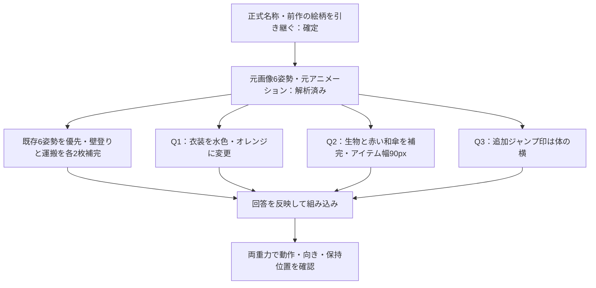
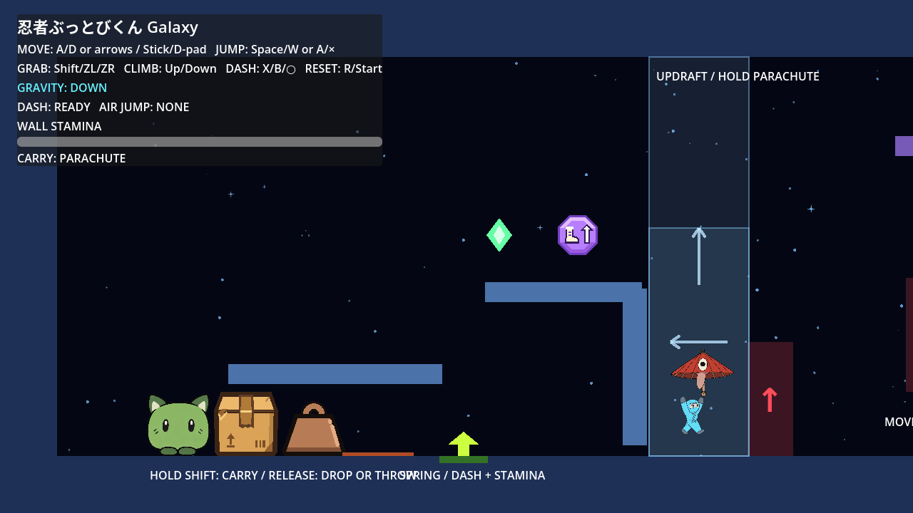

# 忍者ぶっとびくん Galaxy：キャラクタースプライト

## 確定した前提

正式名称は「忍者ぶっとびくん Galaxy」。リポジトリ名の `2d-space` と区別する。前作「忍者ぶっとびくん」のキャラクタースプライトを引き継ぎ、不足する姿勢だけ元の絵柄を尊重して少数フレームで補う。

添付ファイルの調査結果と、ユーザーの回答を反映したスプライトの割り当て。ゲームへの組み込みを実施した。

## 添付ファイルの調査

`820d19f30cb3e46e.zip` は212項目のWindows向けUnityビルドで、`ButtobiKun.exe`、`ButtobiKun_Data`、`MonoBleedingEdge` を含む。編集用の `Assets`、`.meta`、`.anim` は含まれていない。

Unity 2022.3.48f1のビルドで、serialized assets 8,368件、17件のSprite、5本のAnimationClip、2つのAnimatorController、18 Scene、`Assembly-CSharp.dll` を調査した。キャラクターの異なる絵は主役の6姿勢で、「忍者(run)」は歩行画像と同じ絵。ほかは城、足場、タイトル、背景、UIで、現在のJump CreatureとParachute Creatureに相当する画像はない。

Texture2DをそのままPNGにすると、キャラクターの周囲に線状の余分な画素が残る。UnityのSprite meshを使って切り出すと、実際の輪郭を復元できる。

画像はビルド内のDXT5圧縮テクスチャから抽出したもの。未圧縮の元画像や編集用プロジェクトは添付に含まれていない。

| 元画像名 | 前作での役割 | 今作への割り当て |
| --- | --- | --- |
| `tachi` | 立ち姿 | 待機、着地後の基本姿勢 |
| `aruki` | 歩行の1コマ目 | 接地中の歩行A |
| `aruki2` | 歩行の2コマ目 | 接地中の歩行B |
| `jamp` | ジャンプ。壁スライドでも再使用 | 上昇、壁キック、Spring発射、Dashの基本姿勢 |
| `kouka` | 通常の下降 | 頂点から落下への姿勢。頭上保持の補完にも参照 |
| `rakka` | 頭を天井にぶつけた反応 | 頭をぶつけたときの短い反応。通常落下には使わない |

歩行クリップは `0.00秒: aruki → 0.25秒: aruki2 → 0.50秒: aruki`、総長約0.517秒のループ。ほかの4クリップは1枚の静止姿勢で、各約0.0167秒。クリップのsample rateは60Hzだが、歩行の画像切り替え頻度は約4コマ／秒。

主役のSprite rectは共通の1000×1000、pivotは中央、100px/unit。切り出した画像の大きさだけで位置や倍率を合わせると、姿勢の切り替えで足や胴体がずれる。`textureRectOffset` と共通キャンバスを復元してから、今作の表示位置を合わせる。

## ゲームへの組み込み

プレイヤーは36×52、Jump Creatureは24×24、Parachute Creatureは28×28の矩形の当たり判定を持つ。ポリゴンの仮表示をGodot標準のAnimatedSprite2Dへ置き換えた。主役の元画像6枚に、壁登り2枚・運搬2枚を補完して使う。

プレイヤーの重力反転は表示全体を0.12秒で180度回転する。スプライトの左右反転を補正し、天井を歩いているときも画面上の移動先を向く。保持位置は頭側。保持物の物理的な回転は0のまま、画像だけを重力に合わせて反転する。

忍者の衣装はDash使用可能なら水色、使用済みならオレンジ。紺色の布の画素だけをシェーダーで変え、肌・目・灰色の手足を保つ。追加ジャンプ残数の山形は体の横へ移した。

緑の生物、赤い和傘、軽い箱、重い箱の表示幅は90px。忍者の体幅36pxの2.5倍にあたり、縦横比を保って拡大する。置いたときは当たり判定の底に、保持中は忍者の上げた手に画像の下端を合わせる。移動・運搬の当たり判定は従来のサイズを使う。

傘の中央の持ち手は前側の片手に合わせ、箱・生物は両手の上に置く。デモの軽い箱と重い箱の間隔も広げ、拡大した画像が重ならないようにした。

## 少数フレームでの補完

元画像の衣装の形、灰色の手足、顔つき、手描きの黒い輪郭を保つ。衣装色は上記のDash状態に合わせる。各姿勢の役割を明確にし、中間画像を大量に追加しない。生成画像と使用プロンプトは [assets/characters/PROMPTS.md](../assets/characters/PROMPTS.md) に記録した。

| 動作 | キーフレームと再使用 |
| --- | --- |
| 待機・歩行 | 既存の立ち1枚と歩行2枚を使用。切り替え速度は今作の移動速度に合わせる |
| ジャンプ・落下 | 上昇 `jamp` → 頂点 → 下降 `kouka`。重力に対する実速度で姿勢を切り替える |
| 着地 | 接地直後に短く沈む → `tachi`。表示だけを小さく変形し、着地処理を遅らせない |
| Dash | `jamp`を基に、発射方向が伝わる1姿勢を0.15秒のDashに合わせる |
| 壁保持・登り | 壁に手を掛けた姿勢を補完し、静止1枚・登り2枚を共有する。壁スライドは前作の `jamp` を優先 |
| 頭上保持・運搬 | `kouka`の上げた腕を参照し、保持姿勢と歩行の足運びを最少2枚で補う |
| Drop・Throw | 実際に物体を離した時点で、置くときは立ち姿、投げるときは前へ腕を出した `jamp` を短く表示する |
| 緑の生物 | 緑色と耳付きの形を保ち、通常姿勢と追加ジャンプ発動時の反応を2枚で表す |
| 赤い和傘 | 添付画像の一つ目・舌・赤い傘骨を参照。通常と空中保持で開く姿勢を2枚で表し、開いている間は小さく揺らす |

画像の差し替えで当たり判定、移動速度、ジャンプ、Grab、Dashの時間や重力の仕様は変更しない。マントルや投擲の処理をアニメーションの完了待ちにしない。

## 確定した回答

| 質問 | ユーザーの回答 |
| --- | --- |
| Q1：Dash残数の見せ方 | 衣装の色を変える |
| Q2：不足する生物の補完範囲 | 生物も補完。傘は添付画像を参考に赤い和傘。持てるアイテムの表示幅は体幅の約2.5倍、縦横比を維持 |
| Q3：追加ジャンプ残数の表示位置 | 推奨どおり体の横へ移動 |

## 組み込み後の確認

両方の重力で、待機・歩行・ジャンプ・落下・壁保持・壁キック・Dash・運搬・投擲を確認する。足位置のぶれ、左右向き、手と保持物の位置関係、姿勢の優先順位を実際の描画で確認する。

既存テストのうち、体色や旧Body／Visorを直接確認する部分をQ1の表示に合わせる。移動、環境、運搬、チュートリアルの既存テストで、外観の差し替えによる挙動の変化がないことを確認する。アニメーション選択と重力反転時の向きには、共通の小さな実行可能チェックを残す。

正式名称をGodotのプロジェクト名、ステージ選択画面、デモのHUD、READMEに反映した。

Godot 4.7.2で全10テストが成功。保持物の持ち手とデモの配置を調整した後、キャラクター・運搬・デモの3テストも再確認した。描画を有効にした環境で、衣装の色、拡大したアイテム、赤い傘と手の接点を確認した。

[動作プレビューGIF](screenshots/characters/preview.gif)には、歩行、ジャンプ・Dash、和傘での浮上、生物を持った追加ジャンプを収録した。
