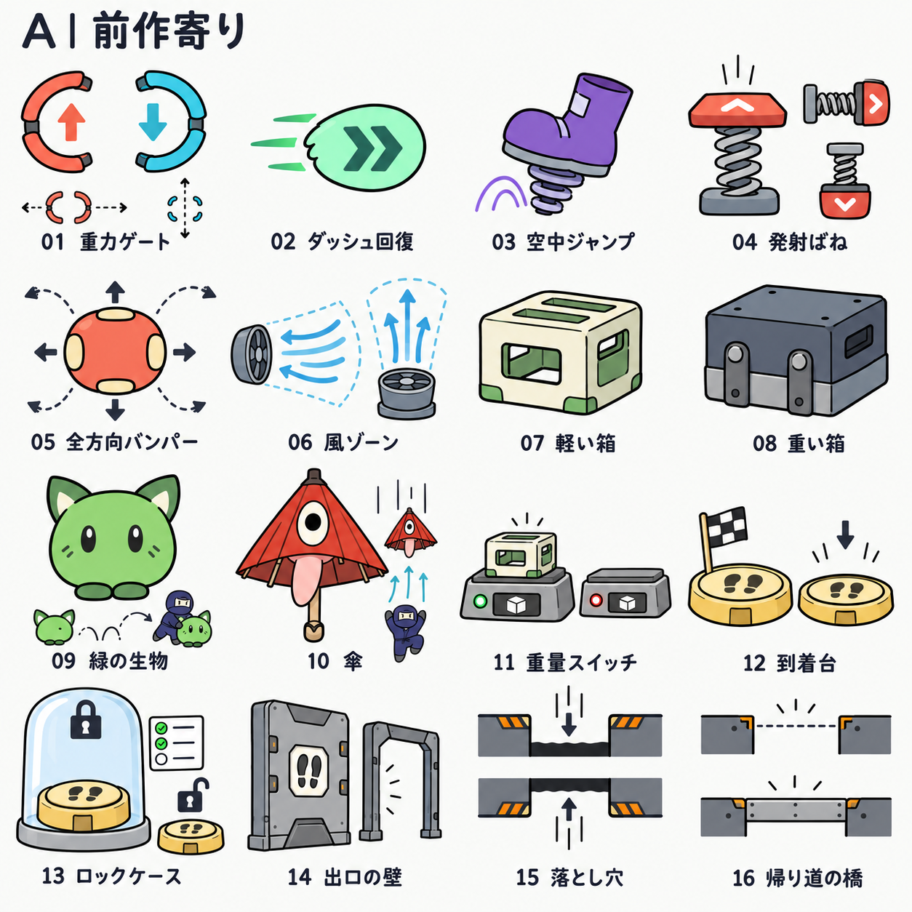
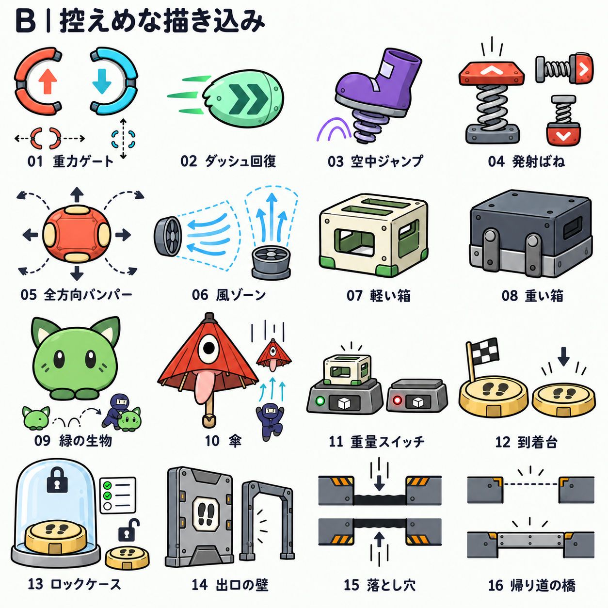

# 忍者ぶっとびくん Galaxyの既存ギミックとデザイン見本

独立したギミック12種類と、関連する仕組み4項目を、A・Bの2つの描き込みで描いた。仮デザインの形を引き継ぐことを条件にせず、触る・通る・運ぶ・物を置くといった役割が伝わる形から考え直す。既存の緑の生物と傘は、現在のデザインを基準に両案へ載せた。

16項目の役割は既存のゲームを確認したもの。ユーザーが比較見本からAを選択したため、Aの描き込みと見本の形を今後の基本案にする。Q4では、形・機能の記号を共通に保ち、材質や土台を各ステージの環境へ合わせる案を選択した。

## 2パターンの比較

- **A：前作寄り。採用する基準。** 手描きの黒い輪郭と大きな色面を中心にする。部品を見分けるために必要な最小限の陰影を使う。
- **B：控えめな描き込み。比較資料。** Aと同じ形・配置・機能の記号を使い、縁の陰影、部品の厚み、少数の継ぎ目や留め具を加える。

番号と項目は両案で共通。どちらも1254×1254pxの画像生成による見本。矢印、移動経路、使用例、押す前後の図を含むため、これをそのままスプライトとしてゲームへ置くものではない。

## 全項目の役割とデザイン案

| 番号 | 項目 | 既存の役割と状態 | 新しい形で伝えること |
| --- | --- | --- | --- |
| 01 | 重力ゲート | 通過した忍者の重力を上向き／下向きに設定。固定、横往復、縦往復の配置がある | 中央が空いた対の発生器で通過できる領域を示す。内部の上下矢印は重力、外側の点線と矢印はゲートの移動を表す |
| 02 | ダッシュ回復（Dash Crystal） | 触れるとダッシュを1回使える状態にする。取得後は消え、復活する。壁スタミナは回復しない | 二連の速度記号と流線を持つ、浮いた回復アイテム。単なる宝石とは違う形で素早い移動を連想させる |
| 03 | 空中ジャンプ付与（Jump Crystal） | 触れるとプレイヤー自身の追加空中ジャンプを1回使える状態にする。取得後は消え、復活する | ばね付きの靴と短い跳躍の軌跡。ダッシュ回復とは輪郭から区別する |
| 04 | 方向固定の発射ばね（Spring） | 表側から触れると一定方向へ発射。床・左右の壁・天井の配置がある。ダッシュと壁スタミナも回復 | 接触板と圧縮されるばねを見せ、発射方向を板の記号で示す。裏側との違いを形で伝える |
| 05 | 全方向バンパー（PinballSpring） | 接触位置と進入方向に応じて反射。ダッシュと壁スタミナも回復 | 丸い弾性体と外向きの反発の図。発射ばねのような一方向専用の接触板は付けない |
| 06 | 風ゾーン | 領域内で風が移動に作用。現配置は左向きの横風と上向きの風。傘を持つと上昇気流で浮上できる | 送風口と流れる線で、風の方向と作用範囲を示す。送風口は領域を理解するための外観で、操作する新装置ではない |
| 07 | 軽い箱 | 掴む、運ぶ、置く、投げることができる。保持中の移動・ジャンプの低下はない | 空洞や大きな開口を持つ軽そうな運搬ケース。手掛かりと平らな上面を見せる |
| 08 | 重い箱 | 同じ運搬操作ができ、保持中は移動・ジャンプが低下。重量は軽い箱の4倍 | 中身の詰まった低い運搬ブロック。厚い底と持ち手で、持てることと重さを伝える |
| 09 | 緑の生物（Jump Creature） | 保持中に生物の残数で追加空中ジャンプを1回提供。保持したまま着地すると回復 | 現在の生物を基準にする。身体へ新しい装備を付けず、別の使用例で保持と跳躍を示す |
| 10 | 傘（Parachute Creature） | 保持中に重力方向への落下を遅くする。上昇気流で浮上。開閉と重力反転に対応 | 現在の赤い一つ目・舌付きの傘を基準にする。別の使用例でゆっくり落ちることと風を受けることを示す |
| 11 | 重量スイッチ | 置かれた持てる物体の合計重量が条件を満たす間ON。取り除くとOFF。現配置では軽い箱も重い箱も押せ、忍者だけでは押せない | 四角い計量トレーと運搬物の記号。軽い箱を載せたON状態、空のOFF状態を並べる。到着台の足跡とは区別する |
| 12 | 到着台 | 通常重力で上面へ着地し、押し込みを完了すると出口を開く。押下後はその位置に固定 | 足跡がある丸いゴール台と小さなチェッカー旗。上に乗る面と沈む面を明確にする。ばねや箱の記号は付けない |
| 13 | ロックケース・南京錠 | チュートリアルの課題未達成時に到着台を覆い、押せなくする。達成すると覆いと鍵が消える | 中の到着台が見える透明の保護フードと、ロック・課題進捗の記号。鍵を拾うアイテムには見せない |
| 14 | 出口の壁 | 到着台の押下による部屋クリアで、通行を遮っていた壁が消える | 閉じた壁と、消えて通れるようになった通路を並べる。到着台と同じ足跡の記号で関係を示す |
| 15 | 床・天井の穴と危険な縁 | 地形の切れ目。重力方向へ落ちて部屋の外へ出ると復帰地点へ戻る。床穴と天井穴の配置がある | 穴の縁だけに警告を置く。床穴には下向き、反転時の天井穴には上向きの落下の図を使う |
| 16 | 帰り道の橋 | ステージ2の部屋3〜6で、クリア後に床穴を塞ぐ足場が出現。穴の警告も消える | 穴が開いている状態と、橋が出て渡れる状態を並べる。通常の移動足場や手動の橋にはしない |

01〜12が独立したギミックの種類。13は到着台に付属するロック機構、14・16は部屋の進行で状態が変わる仕組み、15は地形の切れ目。通常の床・壁・足場や、操作説明・HUD・背景は、この番号一覧とは別に扱う。

## 見分け方の基準

色を隠しても、輪郭と接触する面から違いを読み取れる形を目指す。特に、空いた重力ゲートと通れない出口の壁、箱を置く重量スイッチと忍者が乗る到着台、方向固定の発射ばねと丸い全方向バンパーを区別する。

運搬物は手掛かりを共通の目印にし、軽い箱と重い箱は空洞と密な形で重量差を伝える。回復アイテムは台座へ固定せず、拾うものだと分かる独立した輪郭にする。

図の風の範囲やゲートの移動経路は説明用。新しい壁やレール、操作装置を追加する意味ではない。ロックケースのチェックリストも課題達成を示す例であり、全ての部屋が3課題という意味ではない。重量スイッチは持てる物体の重量で判定し、見本に描いた箱だけへ対象を制限するものではない。

静止画だけで役割を十分に伝えられるかは、ゲーム内での大きさと配置を使って確かめる。押し込み、反発、風の流れ、ゲートの往復、解錠・消失など、既存の挙動も理解を助ける手掛かりになる。

## 環境に合わせて変える範囲

全ステージで、形・機能の記号・識別用の色・接触面を共通にする。材質を示す少数の線や色面、土台、接触に関わらない側面の飾りで環境へ馴染ませる。例えば到着台の足跡・丸い押す面・旗は保ち、金属板、整備された石、自然の岩、風化した岩へ据え付ける。

重力ゲートを塞がった岩に見せたり、発射ばねの接触板を植物で隠したりしない。緑の生物と傘は外観を変えない。背景・地形と組み合わせた4つの環境見本は [ステージの絵柄の方針](art-direction.md) を参照する。

## 確認した実装

- 重力ゲート：`scripts/gravity_gate.gd`、`scenes/gravity_gate.tscn`。
- ダッシュ回復・空中ジャンプ付与：`scripts/refill_crystal.gd`、`scripts/player.gd`、`scenes/refill_crystal.tscn`、`scenes/jump_crystal.tscn`。
- 発射ばね・バンパー：`scripts/spring.gd`、`scripts/pinball_spring.gd`、`scripts/player.gd`。
- 風：`scripts/wind_area.gd`、`scripts/player.gd`。
- 運搬物：`scripts/grabbable.gd`、`scripts/heavy_object.gd`、`scripts/jump_creature.gd`、`scripts/parachute_creature.gd`、各対応シーン。
- 重量スイッチ：`scripts/pressure_button.gd`、`scenes/pressure_button.tscn`。
- 到着台・ロック：`scripts/arrival_switch.gd`、`scenes/arrival_switch.tscn`。
- 実配置、出口の壁、穴、帰り道の橋：`scenes/main.tscn`、`scenes/tutorial.tscn`、`scenes/stage_2.tscn`、`scripts/tutorial.gd`、`scripts/stage_2.gd`。

生成手段とプロンプトは [生成記録](art-direction/GIMMICK-PROMPTS.md) に保存した。今回の作業は見本と一覧の作成まで。ゲームの素材・シーン・挙動は変更していない。
