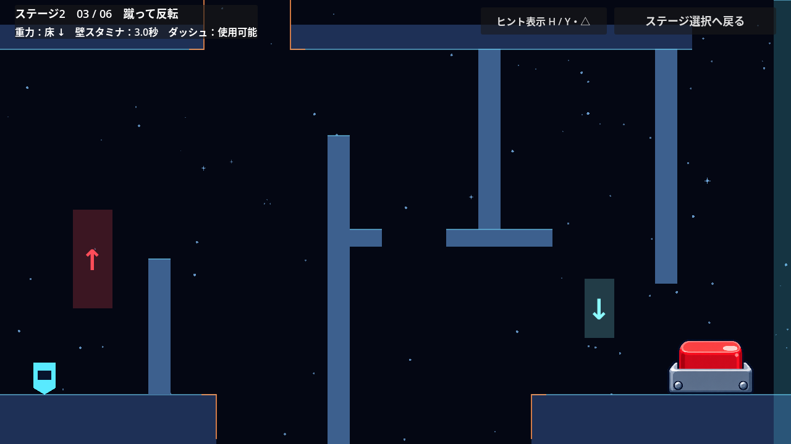
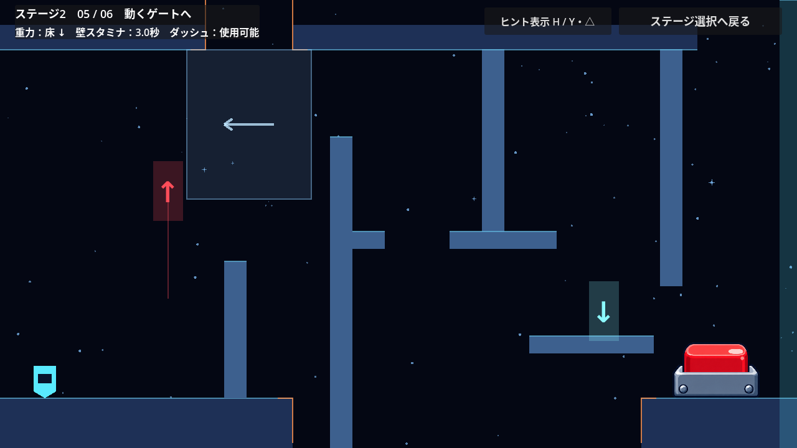
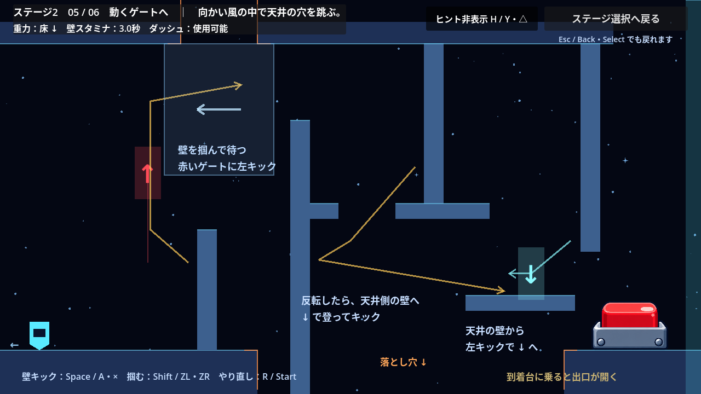
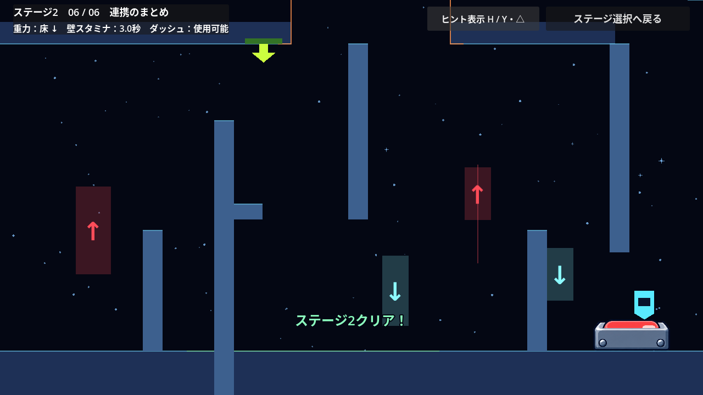

# 第２ステージ

状態：実装済み。天井と床に落とし穴を配置し、向かい風・Springで反転後の経路も難しくした。説明文と経路の矢印は初期状態で非表示。

## 現状と既存の方針

- ステージ1は、16部屋のチュートリアル本編と任意のSuperdash練習部屋で構成される。
- ステージ2は選択画面に「壁キックと重力」と表示され、1部屋目から開始できる。
- 実装済みステージは自由に選択できる。前のステージのクリアを開始条件にしない。
- 選択画面へ戻ると進捗を破棄する。セーブ・途中再開は追加しない。
- 既存のギミックには重力ゲート、ダッシュ、壁アクション、クリスタル、Spring、PinballSpring、風ゾーン、持てる物体、重量スイッチがある。

出典：[ステージ選択の仕様](stage-selection.md)、[README](../README.md)、[用語集](../CONTEXT.md)。

## 決定した方向性

第２ステージでは、壁キックと重力反転のギミックを前面に押し出す。

壁キックは、壁を掴んで上がる「壁登り」と区別する。壁から反対側へ跳び出す動作を課題の中心に据える。

チュートリアルに続く最初の本編ステージとして、1画面単位の6部屋で構成する。難易度アップの要望を受け、チュートリアルで覚えた操作を連続して使う中級向けの配置に調整した。後半ほど連携とタイミングの課題を増やす。

主課題は「壁キックでゲートを通過し、反転後に別の壁を蹴って次の足場へ渡る」とする。ダッシュと壁登りは補助として使えるままにし、張り出しやゲートを含む地形で壁キックと反転を使う経路を作る。

重力ゲートは静止するものを中心に配置し、終盤に移動ゲートを使う課題を入れる。

## 既存の動作による制約

- 同じ壁を蹴って戻る動作を繰り返しても、蹴り出した高さより低い位置へ戻る。壁キックで登る配置には向かい合う壁を使い、幅と高さは実際の入力で攻略して検証する。
- 壁キックは、通常重力では画面上へ、反転中は画面下へ跳び出す。横の速度は720px/s、重力に逆らう速度は560px/s。
- ダッシュ中以外に重力ゲートを通過すると、縦の速度が0になる。横の速度は残る。空中での連携は、この挙動を前提に配置する。
- ダッシュは既存の設定で無効化できる。壁キックを残して壁Grab・壁登りだけを無効化する専用設定はない。
- 壁登りを残しながら、張り出しで壁キックを使わせる配置はチュートリアルの2部屋目にある。
- 既存の到着台は、通常重力で上面に着地すると押せる。操作課題を設けずに解錠することもできる。
- 既存の部屋切り替えと復帰処理では、重力Down、速度0、ダッシュ回復、壁スタミナ最大に戻す。

出典：[プレイヤー](../scripts/player.gd)、[壁キックの回帰テスト](../tests/wall_jump_regression_test.gd)、[チュートリアル](../scenes/tutorial.tscn)、[到着台](../scripts/arrival_switch.gd)、[部屋切り替え](../scripts/tutorial.gd)。

## 6部屋の課題

各部屋は1280×720。足場やゲートの座標は、ダッシュなしの攻略を実入力で確認して調整した。

| 部屋 | 狙い | 配置と遊び |
| --- | --- | --- |
| 1：壁から壁へ | 壁キックで移る | 高い張り出しと離れた壁を交互に蹴り、短い足場へ渡る。下にはやり直せる床を置く |
| 2：天井を進む | 反転中のジャンプと壁キック | Upゲートから天井へ移り、天井の穴をジャンプで越えてから張り出しをキックで渡る。出口の天井壁から小さなDownゲートへ蹴り込む |
| 3：蹴って反転 | 壁キックとゲートの連携 | 壁から空中のUpゲートへ入り、天井の穴をジャンプする。続けて壁キックで渡り、出口の壁を蹴って床へ戻る |
| 4：上下を往復 | 上下それぞれの穴を越える | 反転後に天井の穴を跳び、Downゲートで床へ戻ったら床の穴もジャンプで越える。さらにUpゲートへ壁キックし、最後は天井から床へ戻る |
| 5：動くゲートへ | 移動ゲートと向かい風 | 壁を掴んで小さな移動ゲートを待ち、壁キックで通過する。向かい風の中で天井の穴を跳び、壁を渡る。出口のDownゲートから短い着地足場を経由して到着台へ |
| 6：連携のまとめ | Springから壁を掴み替える | 天井のSpringで画面下へ跳び出し、空中で壁を掴んで交互に蹴り、広い天井の穴を渡る。Downゲートから床へ戻り、速い移動ゲートと出口の壁キックにつなぐ |

## 難易度アップの調整

- 向かい合う壁の張り出しを重力に逆らう方向へ60px移動し、壁の間隔を24px広げた。着地足場の幅は212pxから172pxへ縮め、壁を掴んでから蹴り出す高さとスタミナを意識する配置にした。
- 2〜6部屋目の出口に天井から伸びる壁を追加した。床へ戻るゲートは64×560pxから48×96pxへ縮め、最後の反転にも壁キックを組み込んだ。
- 5・6部屋目の移動ゲートは64×160pxから48×96pxへ縮めた。移動速度は80px/sから、それぞれ140px/s・180px/sへ上げ、端で止まる時間は0.65秒から0.20秒・0.12秒へ短くした。壁を掴んで高さを合わせてから、ゲートが来るタイミングを待てる。
- 6部屋目の途中のDownゲートも48×128pxに縮め、壁を渡った直後のキックで入れる高さに置いた。
- 5部屋目には、出口の反転後に着地する200px幅の足場を置いた。入口側からの穴は残し、床へ戻った後もダッシュなしで着地して到着台へ進めるようにした。

## 落とし穴

床と天井の衝突と見た目を同じ位置で切る。重力反転で床の穴を避けても、実際に通る天井側でジャンプや壁キックを使う課題が残る。

### 天井側

| 部屋 | 穴の範囲（部屋内のX座標） | 幅 | 越え方 |
| --- | --- | --- | --- |
| 2 | 500〜600px | 100px | 反転中の通常ジャンプで越えてから、向かい合う壁へ進む |
| 3 | 330〜470px | 140px | 最初のUpゲート通過後にジャンプする |
| 4 | 320〜450px | 130px | 最初の反転後にジャンプし、天井壁のDownゲートへ進む |
| 5 | 330〜470px | 140px | 向かい風の中で跳び、次の壁キックへつなぐ |
| 6 | 530〜820px | 290px | 手前のSpringから右の壁を掴み、交互の壁キックで越える |

- 5部屋目の向かい風は天井の穴を覆う200×240pxの範囲に置く。風の最大速度は80px/sとし、通常ジャンプでも越えられる余裕を残す。
- 6部屋目のSpringは天井側に下向きで配置し、900px/sで跳び出す。広い穴をただ歩くと画面上へ落ち、Springを使う場合も壁への掴み替えが必要になる。
- 天井の穴はクリア後も残す。通常重力で床側の帰路を使える。

### 床側

| 部屋 | 穴の範囲（部屋内のX座標） | 幅 | 越え方 |
| --- | --- | --- | --- |
| 3 | 350〜860px | 510px | Upゲートから天井側へ移り、壁キックで渡る |
| 4 | 620〜760px | 140px | 床へ戻った後、穴の手前からジャンプする |
| 5 | 470〜1030px | 560px | 既存の穴。移動するUpゲートから天井側の壁へ移る |
| 6 | 340〜800px | 460px | Upゲートから天井側の壁を渡り、Downゲートで出口側の床へ着地する |

- 上下の穴の縁は常にオレンジ色で表示する。「落とし穴 ↓」や経路の矢印はヒントを表示したときだけ見える。
- 床の穴から画面下へ、反転中に天井の穴から画面上へ出ると、その部屋の入口へ自動で戻る。復帰の条件やリセット内容はR / Startと同じ。
- 4部屋目の2つ目のUpゲートは40px上へ移した。穴を越える通常ジャンプでは触れず、次の壁キックで通過できる高さにした。
- 到着台を押すと床の穴を埋める足場が現れ、床の穴の案内を隠す。そのプレイ中はやり直しても足場を保ち、戻って練習できる。

## 進行と復帰

- 各部屋のカメラは固定し、部屋移動のときに横へスライドする。
- 操作回数や体験済み操作のチェックは設けず、到着台にたどり着いて押せば出口が開く。各部屋の到着台は床側に置く。
- 出口から次の部屋へ進める。左端から前の部屋へ戻って練習できる。
- 入室時の入口を復帰地点にする。落下またはR / Startで現在の部屋の入口へ戻し、重力Down、速度0、ダッシュ使用可能、壁スタミナ最大にする。
- やり直し時は、現在の部屋の移動ゲートも初期位置から再開する。すでに開いた出口は、そのプレイ中は開いたままにする。
- 3〜6部屋目は、クリアすると床の穴を埋める足場が現れる。初回は穴を越える課題に挑戦し、クリア後は戻って練習しやすくする。

## 案内と完了

- 初期状態は部屋名とHUDだけを表示し、説明文・操作案内・経路の矢印は隠す。
- 画面右上のボタン、Hキー、ゲームパッドのY／△で、説明文と経路の矢印をまとめて表示・非表示にする。Hキーを押し続けても繰り返し切り替えない。
- ヒントの設定は部屋移動・やり直し・クリア後も保持する。選択画面からステージへ入り直すと非表示に戻る。
- ゲートや風の方向、Springの見た目、穴の縁はギミックを判断する情報として常に表示する。HUDの重力、壁スタミナ、ダッシュの使用可否も常に表示する。
- 6部屋目の到着台を押すと「ステージ2クリア」を表示する。その後も部屋へ戻って練習でき、前の部屋ではクリア表示を隠す。
- Esc / Back・Select、または「ステージ選択へ戻る」ボタンで選択画面へ戻る。再選択すると1部屋目から始まる。

## ファイルの担当

- `scenes/stage_2.tscn`：6部屋の足場・落とし穴・ゲート・風・Spring・到着台・ヒント・経路の矢印。
- `scripts/stage_2.gd`：部屋切り替え、復帰地点、出口とクリア、ヒント表示の管理。
- `scripts/arrival_switch.gd`：本編では `mission_required = false` とし、ケースと操作課題の吹き出しを表示しない。
- `scripts/hud.gd`：本編の部屋名・ヒント・重力・壁スタミナ・ダッシュ。天井側の経路を隠さないよう、上部にコンパクトに表示する。
- `scenes/stage_select.tscn` / `scripts/stage_select.gd`：ステージ2の開始。
- `tests/stage_2_test.gd`：全6部屋の実入力攻略と進行・復帰・完了の確認。

## 動作確認

- ステージ選択からステージ2を開始し、戻る・再選択ができること。
- 6部屋を実際の入力で攻略し、壁キックと重力反転の連携が成立すること。
- ダッシュを使わない攻略経路でも全6部屋を通過できること。
- 上下それぞれの落とし穴へ入力で進み、掴まずに画面外へ落ちると、現在の入口へ戻って重力・スタミナ・ダッシュ・移動ゲートをリセットすること。
- 穴を越える攻略中には落下せず、クリアすると床の穴を埋める足場が現れて案内が隠れること。
- 向かい風による減速とSpringの発動が、実際の攻略経路で起きること。
- ヒントは初期状態で非表示であり、マウス・Hキー・ゲームパッドで切り替えられ、部屋移動とやり直しで保持されること。
- やり直し・逆戻り・移動ゲートのリセット・最終クリアが合意した仕様どおりに動くこと。
- ステージ1のチュートリアル、既存の壁キック・重力ゲート・到着台の動作が維持されること。

```powershell
Godot_v4.7.2-stable_win64_console.exe --headless --fixed-fps 60 --path . --script res://tests/stage_2_test.gd
```

Godot 4.7.2のLinux版で `STAGE_2_TEST_OK`（165項目）と終了コード0を確認した。全6部屋の攻略には位置の変更やギミックの強制発動を使わず、移動・ジャンプ・壁Grabの入力だけを使い、落下によるやり直しも起きていない。攻略に使った壁キックは各部屋で2・3・4・4・4・5回。出口のゲートを通過する前には反転が起きていないことも確認する。5部屋目では実際に風で減速し、6部屋目ではSpringから空中の壁へ掴み替えている。クリア後は5部屋目の到着台を跳び越えて戻り、着地足場の下を歩いて通れることも確認した。上下の落とし穴の検証では、穴の手前に配置したプレイヤーを入力で進ませ、画面外への落下と自動復帰を確認した。画面外への落下や部屋境界の検証でも位置を変更している。

ヒントは初期状態の非表示、マウス・Hキー・Y／△による切り替え、Hキーの長押し、部屋移動・やり直しでの保持、再入場での初期化を確認した。ステージ選択（41項目）・チュートリアルの部屋（48項目）・壁キック（684項目）・環境ギミック（443項目）の回帰テストも成功した。

描画を有効にした環境でも165項目のテストが成功した。全6部屋とクリア画面のスクリーンショットを更新し、5部屋目にはヒント表示時の画像も用意した。








