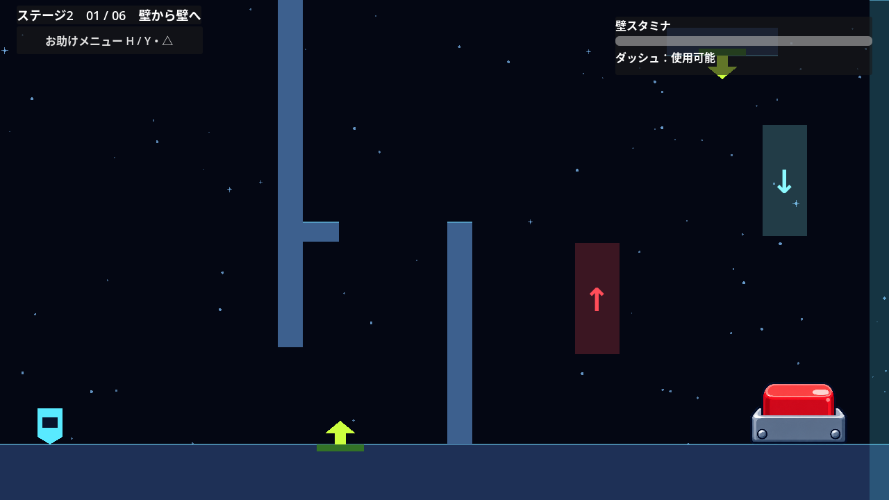
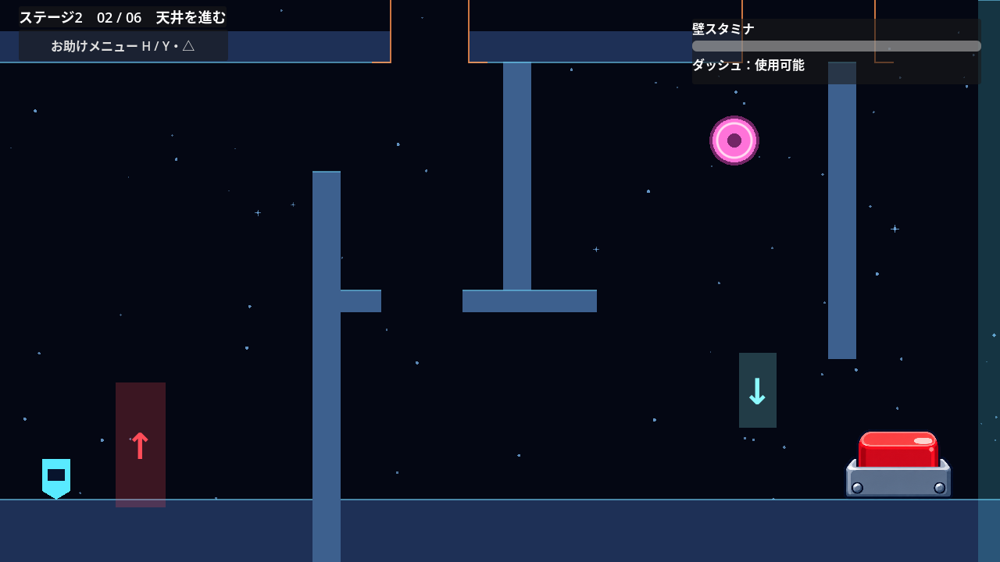
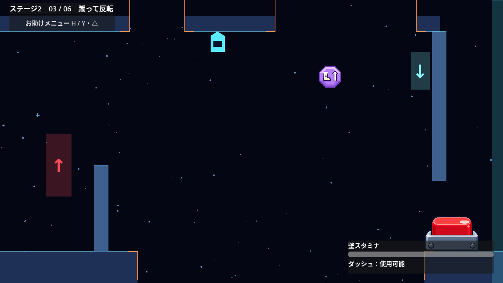
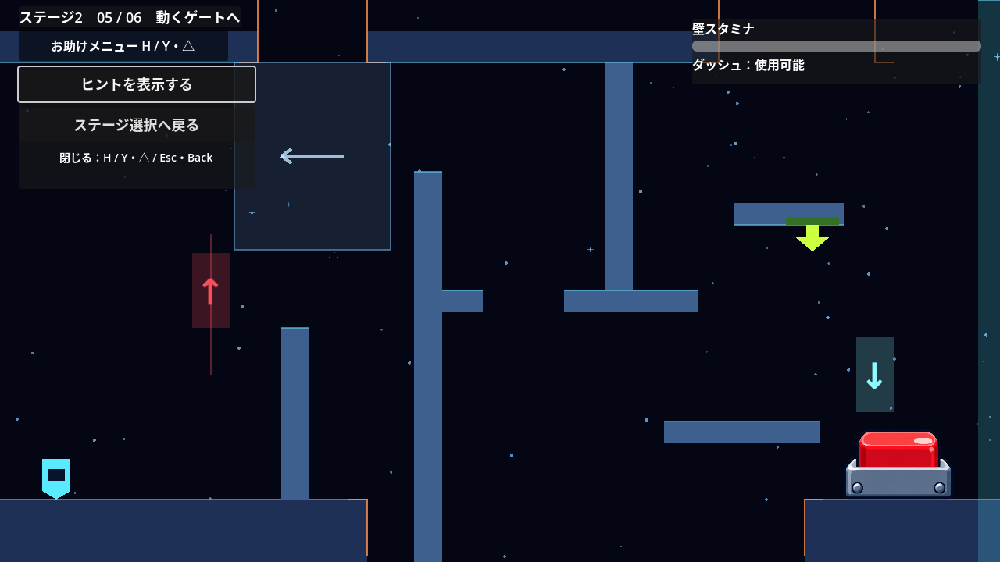

# 第２ステージ

状態：実装済み。1・2部屋目にSpringと反発板を加え、3〜6部屋目の後半にも穴と異なるギミックを配置した。説明文と経路の矢印は初期状態で非表示。

## 現状と既存の方針

- ステージ1は、16部屋のチュートリアル本編と任意のSuperdash練習部屋で構成される。
- ステージ2は選択画面に「壁キックと重力」と表示され、1部屋目から開始できる。
- 実装済みステージは自由に選択できる。前のステージのクリアを開始条件にしない。
- 選択画面へ戻ると進捗を破棄する。セーブ・途中再開は追加しない。
- 既存のギミックには重力ゲート、ダッシュ、壁アクション、クリスタル、Spring、PinballSpring、風ゾーン、持てる物体、重量スイッチがある。

出典：[ステージ選択の仕様](stage-selection.md)、[README](../README.md)、[用語集](../CONTEXT.md)。

## 決定した方向性

第２ステージでは、壁キックと重力反転のギミックを前面に押し出す。

壁キックは、壁を掴んで上がる「壁登り」と区別する。壁から反対側へ跳び出す動作を課題の中心に据える。

チュートリアルに続く最初の本編ステージとして、1画面単位の6部屋で構成する。難易度アップの要望を受け、チュートリアルで覚えた操作を連続して使う中級向けの配置に調整した。後半ほど連携とタイミングの課題を増やす。

主課題は「壁キックでゲートを通過し、反転後に別の壁を蹴って次の足場へ渡る」とする。ダッシュと壁登りは補助として使えるままにし、張り出しやゲートを含む地形で壁キックと反転を使う経路を作る。

重力ゲートは静止するものを中心に配置し、終盤に移動ゲートを使う課題を入れる。

## 既存の動作による制約

- 同じ壁を蹴って戻る動作を繰り返しても、蹴り出した高さより低い位置へ戻る。壁キックで登る配置には向かい合う壁を使い、幅と高さは実際の入力で攻略して検証する。
- 壁キックは、通常重力では画面上へ、反転中は画面下へ跳び出す。横の速度は720px/s、重力に逆らう速度は560px/s。
- ダッシュ中以外に重力ゲートを通過すると、縦の速度が0になる。横の速度は残る。空中での連携は、この挙動を前提に配置する。
- ダッシュは既存の設定で無効化できる。壁キックを残して壁Grab・壁登りだけを無効化する専用設定はない。
- 壁登りを残しながら、張り出しで壁キックを使わせる配置はチュートリアルの2部屋目にある。
- 既存の到着台は、通常重力で上面に着地すると押せる。操作課題を設けずに解錠することもできる。
- 既存の部屋切り替えと復帰処理では、重力Down、速度0、ダッシュ回復、壁スタミナ最大に戻す。

出典：[プレイヤー](../scripts/player.gd)、[壁キックの回帰テスト](../tests/wall_jump_regression_test.gd)、[チュートリアル](../scenes/tutorial.tscn)、[到着台](../scripts/arrival_switch.gd)、[部屋切り替え](../scripts/tutorial.gd)。

## 6部屋の課題

各部屋は1280×720。足場やゲートの座標は、ダッシュなしの攻略を実入力で確認して調整した。

| 部屋 | 狙い | 配置と遊び |
| --- | --- | --- |
| 1：壁から壁へ | Springと壁キックと反転 | 床のSpringで跳び出し、壁を掴んで交互に蹴る。後半のUpゲートから短い天井へ移り、天井のSpringからDownゲートを通って床へ戻る。下にはやり直せる床を置く |
| 2：天井を進む | 反発から壁へ掴み替える | Upゲートから天井へ移り、穴と張り出しを越える。後半は反発板で跳ね返り、空中で出口の壁を掴んでDownゲートへ蹴り込む |
| 3：蹴って反転 | 空中ジャンプで広い穴を越す | 最初の壁キックで反転し、前半の穴を跳ぶ。後半は360pxの天井の穴の中でクリスタルを取り、空中でもう一度ジャンプする。出口のDownゲートへ入り、壁に沿って到着台へ着地する |
| 4：上下を往復 | 縦風と移動する帰還ゲート | 前半の天井と床の穴を順に跳ぶ。2回目のUpゲート後は、縦風の中で後半の天井の穴を越え、壁を掴んで上下移動するDownゲートを待つ |
| 5：動くゲートへ | 短い足場からSpringで飛び出す | 移動Upゲート、向かい風、壁キックを越える。後半は天井の穴の下にある短い足場のSpringで跳び出し、右のDownゲートから到着台へ着地する |
| 6：連携のまとめ | 向かい風と横移動ゲート | 前半のSpringから空中で壁を掴み、交互に蹴って広い穴を越える。2回目のUpゲート後も、向かい風の中で天井の穴を跳び、横移動するDownゲートへ壁キックする |

## 難易度アップの調整

- 1・2・5・6部屋目は、向かい合う壁の張り出しを重力に逆らう方向へ60px移動し、壁の間隔を24px広げた配置を使う。1部屋目ではSpringから右の壁へ掴み替えやすいよう、右の壁から伸びていた足場を取り除いた。
- 2・3・4・6部屋目の出口には天井から伸びる壁を置く。床へ戻るゲートは48×96pxとし、2・4・6部屋目では最後の反転にも壁キックを組み込む。3部屋目は空中ジャンプ、5部屋目はSpringから直接Downゲートへ向かう。
- 5・6部屋目の移動ゲートは64×160pxから48×96pxへ縮めた。移動速度は80px/sから、それぞれ140px/s・180px/sへ上げ、端で止まる時間は0.65秒から0.20秒・0.12秒へ短くした。壁を掴んで高さを合わせてから、ゲートが来るタイミングを待てる。
- 6部屋目の途中のDownゲートも48×128pxに縮め、壁を渡った直後のキックで入れる高さに置いた。
- 5部屋目には、出口の反転後に着地する200px幅の足場を置いた。入口側からの穴は残し、床へ戻った後もダッシュなしで着地して到着台へ進めるようにした。

## 部屋ごとの追加ギミック

- 1部屋目：床のSpringを部屋内X=490pxに配置する。速度900px/sで跳び出し、壁を掴んでから蹴り出す高さを決める。壁を渡った後は（860, 430）のUpゲートからX=960〜1120pxの短い天井へ向かい、（1040, 80）のSpringと（1130, 260）のDownゲートをつなぐ。
- 2部屋目：PinballSpringを（940, 180）に置く。後半の天井を歩く経路は切り、反発後に空中で壁を掴んでDownゲートへ向かう。反発速度の範囲は850〜1000px/s。
- 3部屋目：後半の向かい合う壁を、360px幅の天井の穴とジャンプクリスタルへ置き換える。クリスタルは（840, 195）。ジャンプ中に取り、2回目のジャンプを空中で使う。取得時はヒントが非表示でもHUDに残り1回を表示する。床の穴を730pxへ広げたため、出口のDownゲートを（1070, 180）へ移し、空中ジャンプから出口の壁沿いに着地できるようにした。
- 4部屋目：後半の穴に上向きの風を置く。風の加速度は300px/s²、最大速度は60px/s。出口のDownゲートはX=1030px、Y=500〜350pxを130px/sで往復する。壁を掴んで待ち、ゲートが蹴り出す経路へ来たときに跳ぶ。床の壁を登る抜け道には、X=334px・870pxに幅48px、高さ720pxのUp反転帯を置く。従来の壁キック経路ではすでにUpになっている位置であり、追加の意図しない反転は起こさない。
- 5部屋目：後半の天井を切り、X=940〜1080px・下面Y=288pxの短い足場を置く。その下面のSpringは750px/sで画面下へ押し出し、（1120, 480）のDownゲートへつなぐ。
- 6部屋目：後半の穴に左向きの風を置く。最大速度は100px/s。出口のDownゲートはX=1020〜900pxを160px/sで往復する。穴を跳んだ後も、壁を掴んで横移動するゲートのタイミングを合わせる。

Spring・PinballSpring・クリスタル・風・移動ゲートは、既存のシーンと動作をそのまま使う。部屋ごとにプレイヤーの物理や操作を変えない。

## 落とし穴

床と天井の衝突と見た目を同じ位置で切る。重力反転で床の穴を避けても、実際に通る天井側でジャンプや壁キックを使う課題が残る。

### 天井側

| 部屋・区間 | 穴の範囲（部屋内のX座標） | 幅 | 越え方 |
| --- | --- | --- | --- |
| 2 | 500〜600px | 100px | 反転中の通常ジャンプで越えてから、向かい合う壁へ進む |
| 2・後半 | 950〜1120px | 170px | 反発板から空中で出口の壁を掴む |
| 3 | 330〜470px | 140px | 最初のUpゲート通過後にジャンプする |
| 3・後半 | 700〜1060px | 360px | ジャンプ中にクリスタルを取り、空中ジャンプで距離を伸ばす |
| 4 | 320〜450px | 130px | 最初の反転後にジャンプし、天井壁のDownゲートへ進む |
| 4・後半 | 850〜1020px | 170px | 縦風の中でジャンプし、移動するDownゲートの手前へ着く |
| 5 | 330〜470px | 140px | 向かい風の中で跳び、次の壁キックへつなぐ |
| 5・後半 | 920〜1120px | 200px | 穴の下にある短い足場のSpringからDownゲートへ飛び出す |
| 6 | 530〜820px | 290px | 手前のSpringから右の壁を掴み、交互の壁キックで越える |
| 6・後半 | 950〜1070px | 120px | 向かい風の中でジャンプし、横移動するDownゲートへキックする |

- 5部屋目の向かい風は天井の穴を覆う200×240pxの範囲に置く。風の最大速度は80px/sとし、通常ジャンプでも越えられる余裕を残す。
- 6部屋目のSpringは天井側に下向きで配置し、900px/sで跳び出す。広い穴をただ歩くと画面上へ落ち、Springを使う場合も壁への掴み替えが必要になる。
- 天井の穴はクリア後も残す。通常重力で床側の帰路を使える。

### 床側

| 部屋 | 穴の範囲（部屋内のX座標） | 幅 | 越え方 |
| --- | --- | --- | --- |
| 3 | 350〜1080px | 730px | Upゲートから天井側へ移り、前後の穴をジャンプで渡る |
| 4 | 620〜760px | 140px | 床へ戻った後、穴の手前からジャンプする |
| 5 | 470〜1030px | 560px | 既存の穴。移動するUpゲートから天井側の壁へ移る |
| 6 | 340〜800px | 460px | Upゲートから天井側の壁を渡り、Downゲートで出口側の床へ着地する |

- 上下の穴の縁は常にオレンジ色で表示する。「落とし穴 ↓」や経路の矢印はヒントを表示したときだけ見える。
- 床の穴から画面下へ、反転中に天井の穴から画面上へ出ると、その部屋の入口へ自動で戻る。復帰の条件やリセット内容はR / Startと同じ。
- 4部屋目の2つ目のUpゲートは40px上へ移した。穴を越える通常ジャンプでは触れず、次の壁キックで通過できる高さにした。
- 到着台を押すと床の穴を埋める足場が現れ、床の穴の案内を隠す。そのプレイ中はやり直しても足場を保ち、戻って練習できる。
- 4部屋目の追加反転帯はクリア後に停止して隠す。床の帰路で再び反転することを防ぐ。

## 進行と復帰

- 各部屋のカメラは固定し、部屋移動のときに横へスライドする。
- 操作回数や体験済み操作のチェックは設けず、到着台にたどり着いて押せば出口が開く。各部屋の到着台は床側に置く。
- 出口から次の部屋へ進める。左端から前の部屋へ戻って練習できる。
- 入室時の入口を復帰地点にする。落下またはR / Startで現在の部屋の入口へ戻し、重力Down、速度0、ダッシュ使用可能、壁スタミナ最大にする。
- やり直し時は、現在の部屋の移動ゲートも初期位置から再開する。すでに開いた出口は、そのプレイ中は開いたままにする。
- 3〜6部屋目は、クリアすると床の穴を埋める足場が現れる。初回は穴を越える課題に挑戦し、クリア後は戻って練習しやすくする。

## 案内と完了

- 初期状態は部屋名、ゲージ類、「お助けメニュー」の入口だけを表示し、説明文・操作案内・経路の矢印と、ヒント・選択画面へ戻るボタンを隠す。
- 左上の「お助けメニュー」、Hキー、ゲームパッドのY／△でメニューを開閉する。開いている間はキャラ操作とスタミナ消費を止め、ヒントボタンへフォーカスする。キーボードとゲームパッドでヒント・ステージ選択へ戻るボタンを選べる。閉じるとフォーカスを外し、ジャンプがボタンを押さないようにする。
- メニュー内のヒントボタンで、説明文と経路の矢印をまとめて表示・非表示にする。HやEscを長押ししてもメニューの開閉を繰り返さない。H／Y・△／Esc・Backで閉じられる。
- ヒントの設定は部屋移動・やり直し・クリア後も保持する。選択画面からステージへ入り直すと非表示に戻る。
- ゲートや風の方向、Springの見た目、穴の縁はギミックを判断する情報として常に表示する。壁スタミナは秒数やパーセントを表示しないProgressBarとし、ダッシュ・空中ジャンプと一緒に、通常重力では右上、反転中は右下へ同じフレームで切り替える。文字は上下反転させず、読みやすい向きを保つ。「重力：床↓」の文字は表示しない。
- 6部屋目の到着台を押すと「ステージ2クリア」を表示する。その後も部屋へ戻って練習でき、前の部屋ではクリア表示を隠す。
- メニューを閉じているときのEsc / Back・Select、またはメニュー内の「ステージ選択へ戻る」ボタンで選択画面へ戻る。再選択すると1部屋目から始まる。

## ファイルの担当

- `scenes/stage_2.tscn`：6部屋の足場・落とし穴・ゲート・風・Spring・反発板・ジャンプクリスタル・到着台・ヒント・経路の矢印。
- `scripts/stage_2.gd`：部屋切り替え、復帰地点、出口とクリア、お助けメニュー・ヒント表示の管理。
- `scripts/arrival_switch.gd`：本編では `mission_required = false` とし、ケースと操作課題の吹き出しを表示しない。
- `scripts/hud.gd`：本編の部屋名・ヒント・壁スタミナ・ダッシュ。ゲージ類を重力と反対側に置いて経路を隠しにくくする。
- `scenes/stage_select.tscn` / `scripts/stage_select.gd`：ステージ2の開始。
- `tests/stage_2_test.gd`：全6部屋の実入力攻略と進行・復帰・完了の確認。

## 動作確認

- ステージ選択からステージ2を開始し、戻る・再選択ができること。
- 6部屋を実際の入力で攻略し、壁キックと重力反転の連携が成立すること。
- ダッシュを使わない攻略経路でも全6部屋を通過できること。
- 上下それぞれの落とし穴へ入力で進み、掴まずに画面外へ落ちると、現在の入口へ戻って重力・スタミナ・ダッシュ・移動ゲートをリセットすること。
- 穴を越える攻略中には落下せず、クリアすると床の穴を埋める足場が現れて案内が隠れること。
- 前半・後半のすべての天井の穴で、移動だけでは落下して復帰すること。
- 1部屋目の2つのSpringと反転、2部屋目の反発板、3部屋目のクリスタルと空中ジャンプ、4部屋目の縦風と移動ゲート、5部屋目の出口Spring、6部屋目の向かい風と横移動ゲートが、実際の攻略経路で機能すること。
- メニューとヒントは初期状態で非表示であり、マウス・Hキー・ゲームパッドでメニューを開閉でき、その中でヒントを切り替えられること。ヒントは部屋移動とやり直しで保持されること。
- 3部屋目の壁上からジャンプし、横・斜め上ダッシュを0・15・30・45・55・60フレーム後に使っても、床の穴を越えてクリアできないこと。4部屋目は床の2つの壁を登っても反転帯に触れること。
- スタミナゲージが実際の消費量を表示し、重力反転と同じフレームで画面の反対側へ移ること。
- やり直し・逆戻り・移動ゲートのリセット・最終クリアが合意した仕様どおりに動くこと。
- ステージ1のチュートリアル、既存の壁キック・重力ゲート・到着台の動作が維持されること。

```powershell
Godot_v4.7.2-stable_win64_console.exe --headless --fixed-fps 60 --path . --script res://tests/stage_2_test.gd
```

Godot 4.7.2のLinux版で `STAGE_2_TEST_OK`（264項目）と終了コード0を確認した。全6部屋の攻略には位置の変更やギミックの強制発動を使わず、移動・ジャンプ・壁Grabの入力だけを使い、落下によるやり直しも起きていない。攻略に使った壁キックは各部屋で2・3・1・4・3・5回。1部屋目では2つのSpringと重力反転をつなぎ、5・6部屋目でもSpringが発動する。2部屋目では反発板から出口の壁へ掴み替えている。3部屋目では空中でクリスタルを取り、実際に空中ジャンプからDownゲートへ進む。4・6部屋目では後半の風の範囲を通過して穴を跳び、移動Downゲートへ壁キックする。反転はそれぞれUp・Downを2回ずつで、追加の反転帯による意図しない反転も起きていない。クリア後は5部屋目の到着台を跳び越えて戻り、着地足場の下を歩いて通れることも確認した。前半・後半すべての天井の穴と床の穴の検証では、穴の手前に配置したプレイヤーを入力で進ませ、画面外への落下と自動復帰を確認した。画面外への落下や部屋境界、4部屋目の2つ目の床の壁の単独検証では位置を変更している。

修正前の抜け道は実入力で再現した。3部屋目は壁の上でジャンプし、45フレーム待って斜め上へダッシュするとX=933.97pxの床へ着地し、反転なしで到着台を押せた。4部屋目は床の2つの壁を登り、2回のジャンプだけで到着台へ進めた。こちらも反転は0回だった。修正後は3部屋目の横・斜め上ダッシュの12通りを試し、すべて落下による復帰となった。4部屋目は両方の床の壁から反転帯に触れること、クリア後は帯が停止して帰路を妨げないことを確認した。

お助けメニューとヒントの初期非表示、マウス・Hキー・Y／△による開閉、ゲームパッドのA／×によるヒント切り替え、キーボードによる選択画面への移動、Hキーの長押し、部屋移動・やり直しでのヒント保持、再入場での初期化を確認した。スタミナゲージと実際の残量の一致、重力反転と同じフレームでの上下切り替え、メニューを閉じたときのフォーカス解除も検証した。ステージ選択（41項目）・チュートリアルの部屋（48項目）・壁キック（684項目）・環境ギミック（443項目）の回帰テストも成功した。

描画を有効にした環境でも同じテストを実行し、全6部屋とクリア画面のスクリーンショットを更新した。5部屋目のヒント表示、閉じて始まるお助けメニューを開いた状態、3部屋目で反転中のゲージ位置も画像で確認した。











