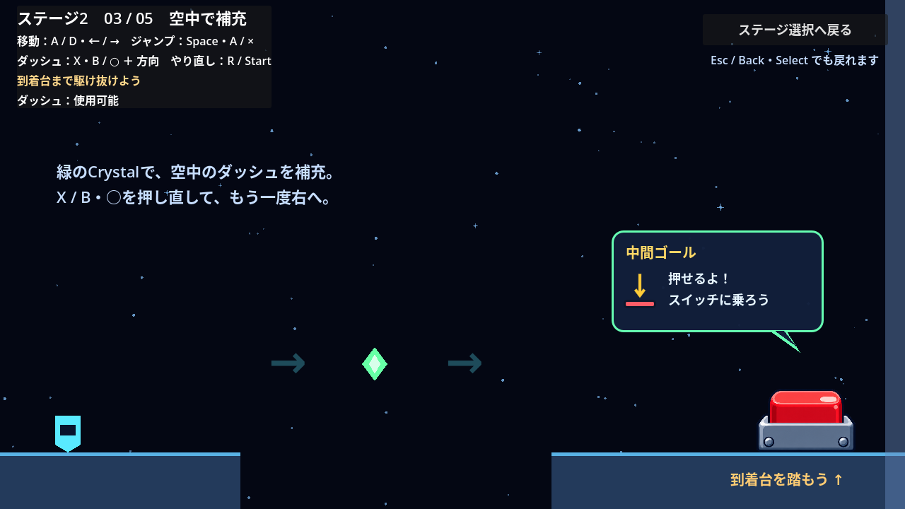

# ステージ2：ダッシュ航路

## 確定した方針

- 難易度は初級。
- ダッシュで気持ちよく駆け抜けることを、遊びの中心にする。
- 最初の構成は5部屋。
- 各部屋は到着台を踏むことでクリアする。チュートリアルのような指定操作の達成チェックは設けない。
- ステージ途中の部屋の到着台は、中間ゴールとして扱う。
- 横ダッシュを中心にし、着地点を広く取る。精密な斜め入力やSuperdashは必須にしない。
- 落下、R / Startで現在の部屋の入口からやり直す。到着台を押して次の部屋へ進むと、その入口が新しい復帰地点になる。
- 5部屋目の到着台を押すとクリア表示を出す。その場で操作を続けられ、前の部屋にも戻れる。

## 5部屋の構成

| 部屋 | 遊びと配置 |
| --- | --- |
| 1：助走 | 安全な床の上で横ダッシュし、着地後の再使用で加速する |
| 2：踏み切り | ジャンプから横ダッシュで260pxの穴を越え、広い足場へ着地する |
| 3：空中で補充 | 440pxの穴の途中にある緑のDash Crystalを取り、空中で再ダッシュする |
| 4：弾んで加速 | 床Springで跳び出し、右へのダッシュで80px高い足場へ着地する |
| 5：駆け抜ける | Spring、Crystal、再ダッシュを繋いで中間足場へ。もう一度Springで跳び出し、最後の到着台へ進む |



## 進行と復帰

各部屋は1280×720の固定画面。1〜4部屋目の到着台を押すと右の出口が開き、画面右端へ進むと次の部屋へ0.28秒でスライドする。切り替え中だけ操作を止める。到着台はジャンプなどで上面に着地し、約0.2秒踏み込むと作動する。

ステージ開始時からダッシュと壁アクションを使える。やり直し時は重力Down、速度0、Dash使用可能、Air Jumpなし、壁スタミナ最大へ戻り、その部屋のCrystalもすぐに戻す。クリア済みの部屋の到着台と出口は維持する。前の部屋へ戻った場合は、その部屋の出口側を復帰地点にする。

最初の部屋は全面に安全な床を置く。2〜5部屋目の穴へ落ちると、その部屋から再挑戦できる。操作ミッションや待ち時間のあるゲートは設けず、到着台まで辿り着けば別の解き方でもクリアできる。

Esc / Back・Select、または右上の「ステージ選択へ戻る」で選択画面へ戻る。部屋の切り替え中も戻れる。再びステージ2を選ぶと1部屋目から始まり、前回の進捗は引き継がない。

5部屋目のクリア後は自動で別の画面へ移動しない。クリア表示を出したまま練習でき、やり直してもクリア状態を保つ。

## 既存仕様との関係

[ステージ選択の仕様](stage-selection.md)に従い、実装したステージは自由に選べる。ステージ1のクリアを開始条件にはしない。

## 調整と確認

足場・入口・Crystal・Spring・到着台の配置は`scenes/stage_2.tscn`、部屋の切り替えとクリア表示は`scripts/stage_2.gd`で調整する。到着台は既存Sceneの`locked = false`で、ミッションなしでも初めから踏める状態にする。

```sh
godot --headless --fixed-fps 60 --path . --script res://tests/stage_2_test.gd
godot --headless --fixed-fps 60 --path . --script res://tests/stage_select_test.gd
```

`STAGE_2_TEST_OK`と`STAGE_SELECT_TEST_OK`、終了コード0を成功条件とする。ステージ2のテストでは通常ジャンプと横ダッシュの入力で全5部屋の到着台を実際に踏み、空中補充、Spring、復帰、戻り移動、クリア後の継続、再選択時の初期化を確認する。
