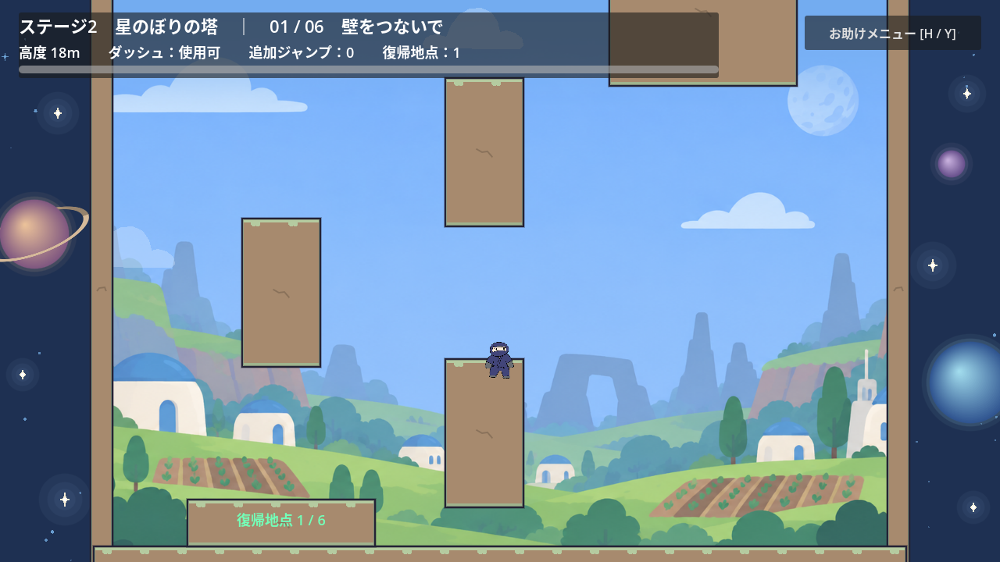
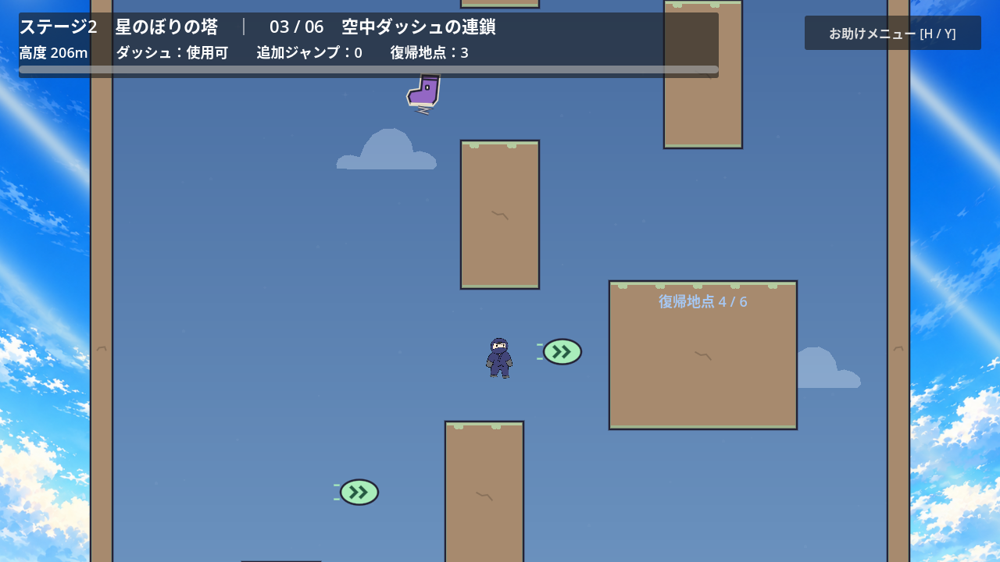
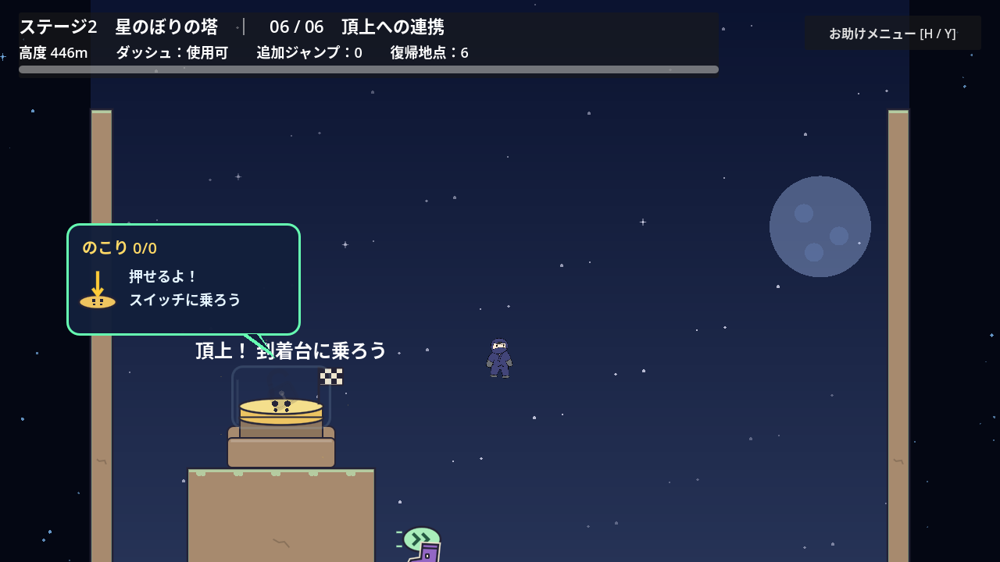

# ステージ2：星のぼりの塔

## コース

上へ登るとカメラが連続して追従する縦コース。全6区間で、1区間の高さ720px、全体の上昇量4320px。足場を15段配置する。第2区間はバネで渡る450px・270pxの高低差とし、途中に幅300pxの休憩足場を置く。第3区間は中継足場を置かず、空中の3個のDash Crystalをつないで720px上の復帰足場へ渡る。第4区間は靴のJump Crystalによる追加ジャンプとダッシュで440px上の休憩足場へ渡り、残り280pxを登る。第5区間は入口で相棒を保持し、追加ジャンプと上ダッシュで430px上の片面足場へ渡り、残り290pxを進む。画面幅は1280pxのまま、左右へ渡りながら上を目指す。

| 区間 | テーマ |
| --- | --- |
| 1 | 壁を掴んで登り、壁キックで反対の壁や足場へ |
| 2 | バネによる上昇から次の壁へ |
| 3 | 空中の緑のクリスタルでダッシュを回復し、上へのダッシュをつなぐ |
| 4 | 紫の靴で追加ジャンプを得て、上ダッシュと組み合わせる |
| 5 | 生物を保持して追加ジャンプ。壁掴み時には手放す |
| 6 | バネと両クリスタルを組み合わせ、頂上の到着台へ |

通常重力で登る。壁アクションとダッシュは最初から使用可能。着地回数による失敗条件は設けず、小さな足場はダッシュ・壁スタミナの回復や休憩に使える。第2区間は入口のバネがないと中間足場へ届かない。区間内の外壁を分断し、通常ジャンプ・8方向ダッシュ・壁登りによる迂回を防ぐ。入口のバネは上向き1450px/s、中間のバネは1100px/s。操作履歴による進行ロックは設けず、地形と既存バネで誘導する。第3区間も外壁を分断し、クリスタルによる回復と複数回のダッシュを必要とする。クリスタルはx740の列に200px間隔で並び、上昇中に次の目標が見える。出口足場は厚さ32pxで、下の側面を長く登る迂回を防ぐ。第4区間の外壁も分断する。最初の休憩足場は幅300px・厚さ16pxとし、通常ジャンプとダッシュでは側面へも届かない440pxの高低差にする。靴は2個とし、次の跳躍から見える位置に置く。第5区間は幅360pxの片面足場を使い、壁掴みや相棒を踏み台にする迂回を防ぐ。相棒はCP05中央から右へ離して置き、地上から掴める。途中の着地で相棒の追加ジャンプを回復する。代わりに使えていた靴3個と、この区間の外壁・中継足場を取り除く。第1・第6区間は従来の壁登り経路を保つ。

## 背景と地形

生活圏の惑星のふもとから、雲の上、星が見える上空へつながる。地表の街や山は序盤にだけ現れ、上昇すると下へ遠ざかる。雲と星には足場より遅い縦方向の視差を付け、空の色を高度に応じて滑らかに変える。

背景はプレイヤーを追うカメラの高さに合わせる。区間の境界では切り替えず、降下や落下からの復帰でも、その高さの景色へ戻る。地表の繰り返しや背景画像の縦引き伸ばしは行わない。足場・左右の壁は現行の生活圏の地形表現に揃え、見た目と当たり判定を一致させる。

背景の動作は `scripts/ascent_backdrop.gd`、地表と空の境目は `assets/environments/ascent.gdshader`、検証は `tests/ascent_backdrop_test.gd`。

## 復帰地点と落下

- 各区間の開始位置に幅240pxの足場があり、端の小さな旗と中央の足跡で着地点を示す。未到達は中空の旗、現在の復帰地点は塗った旗と「↺」、到達済みは塗った旗と「✓」で区別し、番号を添える。旗と印に当たり判定はない。
- 上の区間の復帰足場に着地した時点で更新する。空中で通過するだけでは更新しない。
- 最高到達点から640px落ちるか、最新の復帰足場より180px下へ落ちると自動復帰する。
- R / Startも最新の復帰地点へ戻る。通常重力、速度0、ダッシュ・スタミナ回復、追加ジャンプなしで再開する。
- クリスタルを再出現させ、持てる生物を初期配置へ戻す。カメラも復帰地点へ戻る。
- 選択画面へ戻ると進捗は破棄する。

## 表示・操作

上部には塔の名前・区間番号・高度・ダッシュの使用可否・追加ジャンプ数・壁スタミナを表示する。ダッシュは使用可能なら「●」、使用済みなら「○」。復帰地点の番号を状態欄に重ねず、区間名と詳しい操作説明はヒント表示にまとめる。

Esc・Back／Selectまたは右上の「ポーズ [Esc]」で共通メニューを開く。背景・カメラ・物理・タイマーを含むゲーム全体を停止する。再開、ヒントの切り替え、最新の復帰地点からのやり直し、確認画面を経由するステージ選択への帰還を選べる。ヒントは初期非表示で、やり直しでも設定を保つ。詳しくは [ポーズメニュー](pause-menu.md) を参照。

頂上の到着台を押すとクリアを表示する。自動で画面遷移せず、メニューから戻れる。

## 実装と確認

- `scenes/stage_2.tscn`：Godotエディターで編集できる足場、壁、アイテム、復帰地点、UIの配置。
- `scripts/stage_2.gd`：連続カメラ、復帰更新、落下、ヒント、クリア処理。
- `scripts/player.gd`：既存の復帰範囲を有効・無効にする設定を追加。ステージ2・4では無効にし、ステージ側で落下を判定する。
- `tests/stage_2_test.gd`：実際の物理移動による全区間の登頂、復帰地点更新、クリア、落下復帰、メニュー、再入場を検証。各復帰地点の更新時に、旗と印の表示・非衝突・HUDの収まりも確認する。
- `tests/tower_spring_route_test.gd`：入口から2個のバネを使う成功経路、8方向・6タイミング・4地点の計192通りのバネ非利用の迂回、落下からの安全復帰、通過後のチェックポイント保持を検証。
- `tests/tower_dash_route_test.gd`：クリスタル3個と実際の4回のダッシュを使う成功経路、回復無し・追加ダッシュ無しでの8方向・6タイミング・3地点の計288通りの迂回、回復したダッシュを使わない場合の安全復帰と全クリスタル復活、次のチェックポイント保持を検証。
- `tests/tower_extra_jump_route_test.gd`：靴2個と追加ジャンプ2回による成功経路を追加ジャンプ・ダッシュ各16/20/24フレームの9組で検証。靴無し・追加ジャンプ無しの8方向・6タイミング・3地点の計288通りの迂回、取得後に落下した場合の安全復帰と靴復活、次のチェックポイント保持も確認する。
- `tests/tower_companion_route_test.gd`：相棒を地上で保持して追加ジャンプを2回使う成功経路を、追加ジャンプ・ダッシュ各16/20/24フレームの9組で検証。相棒を取らない・保持しても追加ジャンプを使わない288通りと、実際に相棒へ乗る・乗って同時Grab/Jumpを行う96通りの迂回、保持中の落下復帰と相棒再配置・残数初期化、次CP保持も確認する。
- `tests/stage_select_test.gd`：第2ステージの有効化、方向キー・ゲームパッドでの選択を含めて確認。

```powershell
Godot_v4.7.2-stable_win64_console.exe --headless --fixed-fps 60 --path . --script tests/stage_2_test.gd
```

`STAGE_2_TEST_OK` と終了コード0を成功条件とする。実際に遊んだ際の難易度・テンポはプレイ感に応じて調整する。

## 高度ごとの背景






