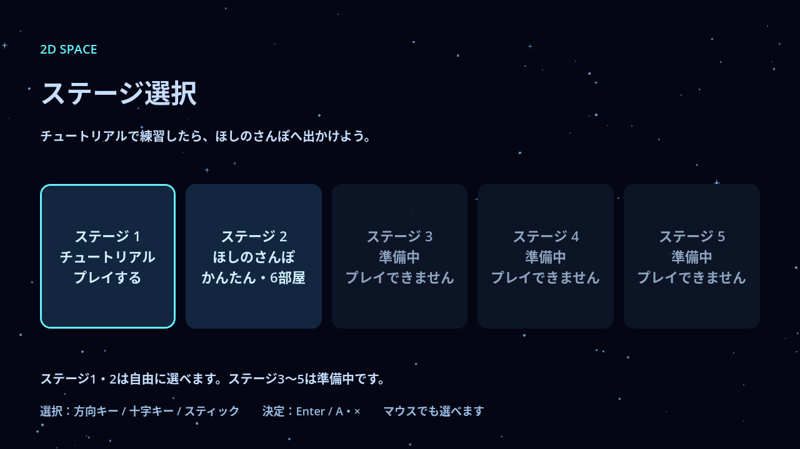
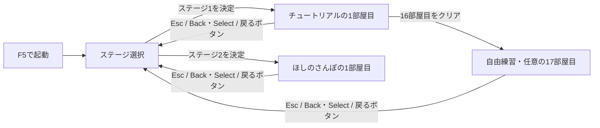

# ステージ選択

## 確定した仕様

F5でプロジェクトを起動すると、ステージ選択画面を表示する。チュートリアルはステージ1として扱い、現在の16部屋の本編と17部屋目の任意練習を含む。

5つのステージを左から右へ、次の順番で並べる。

| ステージ | 表示 | 現在の状態 |
| --- | --- | --- |
| 1 | チュートリアル | 選択すると1部屋目から開始 |
| 2 | ほしのさんぽ | 選択すると1部屋目から開始 |
| 3 | 準備中 | 表示するが選択できない |
| 4 | 準備中 | 表示するが選択できない |
| 5 | 準備中 | 表示するが選択できない |

番号は表示順を表す。実装済みのステージは自由に選べるものとし、前のステージのクリアを条件にした解禁は設けない。ステージ2のコースは [ほしのさんぽの仕様書](stage-2.md) を参照する。ステージ3〜5は未実装。

既存の宇宙背景と水色のアクセントを使う。開始時はステージ1にフォーカスを置き、選択中の枠を明示する。準備中のステージはクリックできず、キーボードやゲームパッドのフォーカスも移らない。



## 操作

| 場所・操作 | マウス | キーボード | ゲームパッド |
| --- | --- | --- | --- |
| 選択画面でステージを選ぶ | ステージをクリック | 方向キー | 十字キー／左スティック |
| 選択中のステージを開始 | ステージをクリック | Enter（Spaceも使用可能） | 決定ボタン A／× |
| ステージ1・2から選択画面へ戻る | 「ステージ選択へ戻る」をクリック | Esc | Back／Select |
| 現在の部屋をやり直す | — | R | Start |

選択画面の操作にはGodot標準のUI入力を使う。プレイ中に戻る操作は専用の `return_to_stage_select` 入力とし、ダッシュに使うB／○や、やり直しに使うStartとは分ける。

## 進行と完了

選択画面へ戻ると、そのプレイの進捗を破棄する。再びステージを選ぶと1部屋目から始まり、クリア済みの部屋を初期状態へ戻す。チュートリアルの操作解禁も初期状態へ戻る。ステージ2では最初からすべての移動操作が使える。セーブや途中再開は設けない。

16部屋目でチュートリアル本編の完了を表示する。クリア後も前の部屋へ戻って練習でき、17部屋目の任意練習にも進める。クリアを理由に自動で選択画面へ戻したり、ステージ2へ移動したりしない。

部屋の切り替え中も、EscまたはBack／Selectで選択画面へ戻れる。

ステージ2では6部屋目の到着台を押すとクリアを表示する。その後も左へ戻って遊べる。自動では選択画面へ戻らない。



## ファイルの担当

- `project.godot`：F5の起動先、UIの決定操作、選択画面へ戻る入力。
- `scenes/stage_select.tscn` / `scripts/stage_select.gd`：選択画面、初期フォーカス、ステージ1・2の開始。
- `scenes/tutorial.tscn` / `scripts/tutorial.gd`：プレイ中から選択画面へ戻る操作。
- `scenes/stage_2.tscn` / `scripts/stage_2.gd`：ステージ2のコースと選択画面へ戻る操作。
- `tests/stage_select_test.gd`：起動、3種類の入力、準備中の項目、戻る操作と進捗初期化の確認。
- `tests/stage_2_test.gd`：ステージ2の開始、全6部屋の踏破、やり直し、選択画面への復帰と進捗初期化。

ギミックデモの `scenes/main.tscn` はF6で実行する。

ステージ3〜5を追加するときは、該当する選択ボタンを有効にし、フォーカスを許可して、追加したステージの開始処理へ接続する。

## 動作確認

```powershell
Godot_v4.7.2-stable_win64_console.exe --headless --fixed-fps 60 --path . --script res://tests/stage_select_test.gd
```

`STAGE_SELECT_TEST_OK` と終了コード0を成功条件とする。既存のチュートリアルと到着台のテストでも、部屋移動・本編完了・任意練習が引き続き動作することを確認する。

Godot 4.7.2のLinux版で選択画面を検証する。キーボードとゲームパッドは入力イベントを模擬し、マウスはViewportへクリックを送って確認する。ステージ2の追加後は、選択画面の40項目と、ステージ2、既存チュートリアル、到着台のテストを対象とする。
